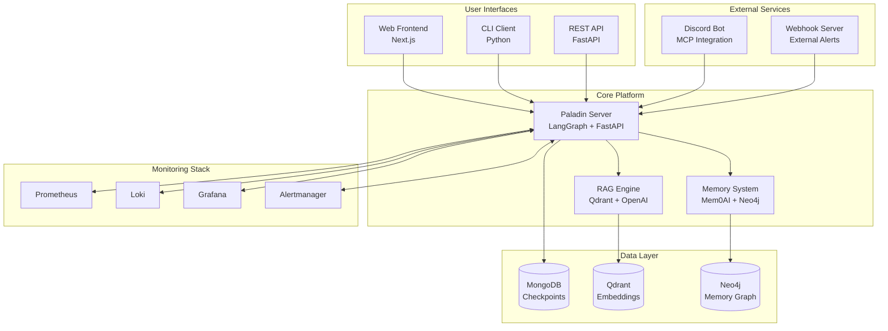

# 🛡️ Paladin AI

> **AI-Powered Monitoring & Incident Response Platform**

Paladin AI is an intelligent monitoring and incident response platform that integrates with existing monitoring infrastructure (Prometheus, Grafana, Loki, Alertmanager) to provide automated incident analysis, intelligent querying, and proactive system insights.

## 🌟 Key Features

- **🤖 AI-Powered Analysis**: Advanced workflow orchestration using LangGraph
- **📊 Monitoring Integration**: Native support for Prometheus, Loki, Grafana, and Alertmanager
- **💬 Multi-Interface Access**: Web UI, CLI, and API interfaces
- **🧠 Intelligent Memory**: Long-term context and learning capabilities
- **📄 Document Processing**: RAG-based document ingestion and retrieval
- **🔄 Session Persistence**: Robust checkpoint and recovery system
- **⚡ Real-time Processing**: Live monitoring and instant incident response

## 🏗️ Architecture Overview



## 🚀 Quick Start

### Prerequisites

- **Python 3.13+** with UV package manager
- **Node.js 18+** with npm/yarn
- **Docker & Docker Compose** (for infrastructure)
- **MongoDB** (for checkpoints)
- **OpenAI API Key** (for AI features)

### 1. Clone and Setup

```bash
# Clone the repository
git clone https://github.com/your-org/paladin-ai.git
cd paladin-ai

# Install all dependencies
make install-dev
```

### 2. Environment Configuration

```bash
# Copy environment template
cp .env.example .env

# Configure required variables
export OPENAI_API_KEY="your-openai-api-key"
export MONGODB_URL="mongodb://localhost:27017"
```

### 3. Start Core Services

```bash
# Start the infrastructure stack
make infra-up

# Start the main server
make run-server

# In another terminal, start the frontend
make run-frontend
```

### 4. Access the Platform

- **Web Interface**: http://localhost:3000
- **API Documentation**: http://localhost:8000/docs
- **CLI**: `paladin-cli chat`

## 📚 Documentation

| Documentation | Description |
|---------------|-------------|
| [Installation Guide](docs/installation.md) | Complete setup and configuration |
| [Architecture](docs/architecture.md) | System design and components |
| [API Reference](docs/api.md) | REST API documentation |
| [CLI Guide](docs/cli.md) | Command-line interface usage |
| [Frontend Guide](docs/frontend.md) | Web interface documentation |
| [Monitoring Integration](docs/monitoring.md) | Prometheus, Loki, Grafana setup |
| [Memory System](docs/memory.md) | AI memory and learning capabilities |
| [RAG System](docs/rag.md) | Document processing and retrieval |
| [Workflows](docs/workflows.md) | LangGraph workflow system |
| [Discord Integration](docs/discord.md) | Discord bot and MCP setup |
| [Deployment](docs/deployment.md) | Production deployment guide |
| [Troubleshooting](docs/troubleshooting.md) | Common issues and solutions |

## 🛠️ Development

### Project Structure

```
paladin-ai/
├── 📁 server/          # Python FastAPI backend
├── 📁 frontend/        # Next.js React frontend  
├── 📁 cli/             # Python CLI client
├── 📁 webhook/         # Webhook server
├── 📁 mcp/             # Discord MCP integration
├── 📁 infra/           # Infrastructure configs
├── 📁 tests/           # Integration tests
└── 📁 docs/            # Documentation
```

### Development Commands

```bash
# Development setup
make install-dev        # Install all dependencies
make dev               # Start full development environment

# Individual services
make run-server        # Start FastAPI server
make run-frontend      # Start Next.js frontend
make run-cli           # Interactive CLI session

# Discord integration
make mcp-server        # Start Discord MCP server
make mcp-worker        # Start message worker

# Testing and quality
make test              # Run all tests
make format            # Format code
make lint              # Run linting
make type-check        # Type checking

# Infrastructure
make infra-up          # Start infrastructure stack
make infra-down        # Stop infrastructure stack
make infra-logs        # View infrastructure logs
```

## 🔧 Core Components

### Server (Python FastAPI)
- **LangGraph Workflows**: Complex AI reasoning chains
- **Tool Integration**: Monitoring system connectors
- **Memory System**: Long-term context and learning
- **RAG Engine**: Document processing and retrieval
- **Session Management**: MongoDB checkpointing

### Frontend (Next.js)
- **Real-time Chat**: WebSocket-based communication
- **Session Management**: Persistent conversation history
- **Document Upload**: Drag-and-drop file processing
- **Dark/Light Themes**: Modern responsive design
- **Command Interface**: CLI-style commands in web UI

### CLI (Python)
- **Interactive Chat**: Rich terminal interface
- **Command History**: Persistent session management
- **File Upload**: Document processing from CLI
- **Monitoring Queries**: Direct monitoring system access

### Infrastructure
- **Mock Environment**: Complete testing stack
- **Monitoring Stack**: Prometheus, Grafana, Loki, Alertmanager
- **Database Systems**: MongoDB, PostgreSQL, Neo4j
- **Caching Layer**: Valkey (Redis-compatible)

## 🎯 Use Cases

### 1. **Incident Investigation**
```bash
# Web UI or CLI
"Investigate high CPU usage in production cluster"

# AI analyzes metrics, logs, and provides insights
# Suggests remediation actions
# Creates incident timeline
```

### 2. **Proactive Monitoring**
```bash
# Set up intelligent alerts
"Monitor memory usage patterns and predict capacity issues"

# AI learns normal patterns
# Detects anomalies early
# Provides recommendations
```

### 3. **Knowledge Management**
```bash
# Upload runbooks and documentation
"Search for kubernetes troubleshooting steps"

# RAG system finds relevant docs
# Contextual answers from knowledge base
# Learning from previous incidents
```

### 4. **Discord Integration**
```bash
# Discord channel monitoring
@paladin "Check status of payment service"

# Bot responds with real-time metrics
# Provides analysis and recommendations
# Escalates critical issues
```

## 🔐 Security

- **API Key Management**: Secure credential handling
- **CORS Configuration**: Controlled cross-origin requests
- **Request Timeouts**: Configurable timeout middleware
- **Error Handling**: Comprehensive error boundaries
- **Session Security**: Encrypted session management

## 🤝 Contributing

1. **Fork the repository**
2. **Create feature branch**: `git checkout -b feature/amazing-feature`
3. **Install dev dependencies**: `make install-dev`
4. **Make changes and test**: `make test`
5. **Format code**: `make format`
6. **Commit changes**: `git commit -m 'Add amazing feature'`
7. **Push to branch**: `git push origin feature/amazing-feature`
8. **Open Pull Request**

### Development Guidelines

- **Code Quality**: Use type hints and follow PEP 8
- **Testing**: Write tests for new features
- **Documentation**: Update docs for new functionality
- **Commits**: Use conventional commit messages

## 📄 License

This project is licensed under Apache 2.0 with Commons Clause License Condition v1.0 - see the [LICENSE](LICENSE) file for details.

## 🆘 Support

- **Documentation**: [docs/](docs/)
- **Issues**: [GitHub Issues](https://github.com/your-org/paladin-ai/issues)
- **Discussions**: [GitHub Discussions](https://github.com/your-org/paladin-ai/discussions)
- **Discord**: [Community Server](https://discord.gg/your-server)

## 🙏 Acknowledgments

- **LangChain & LangGraph**: Workflow orchestration
- **OpenAI**: AI capabilities
- **Mem0AI**: Memory management
- **FastAPI**: High-performance API framework
- **Next.js**: Modern React framework
- **Prometheus Ecosystem**: Monitoring infrastructure

---

<div align="center">

**Built with ❤️ for DevOps and SRE teams**

[Website](https://paladin-ai.dev) • [Documentation](docs/) • [Community](https://discord.gg/paladin-ai)

</div>