# 📊 Paladin AI Architecture Diagrams

This document contains all the Mermaid diagrams from the Paladin AI documentation, organized by component and functionality.

## System Architecture

### High-Level Architecture
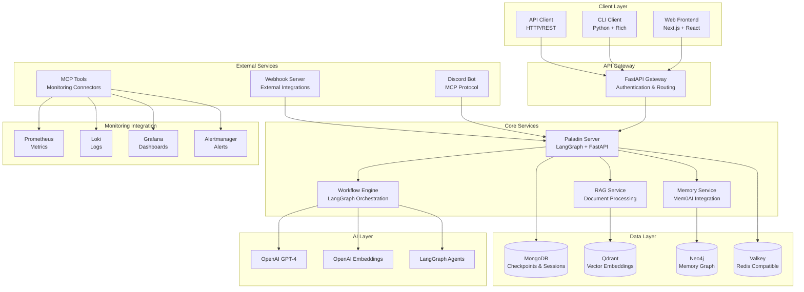

## Deployment Architecture

### Container Orchestration
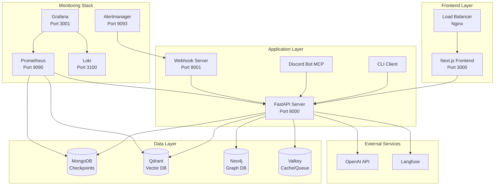


## Discord Integration

### Discord Bot Architecture
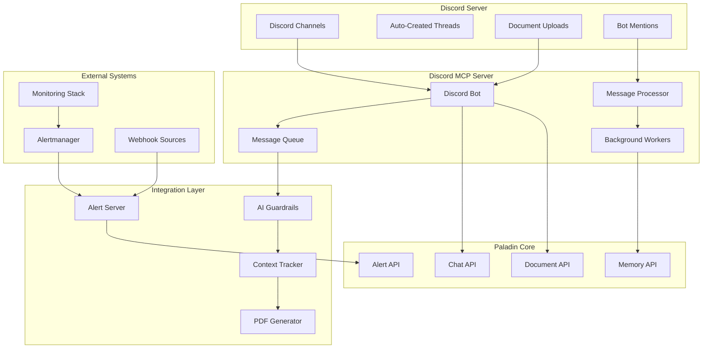

## Workflows

### Workflow Engine Architecture
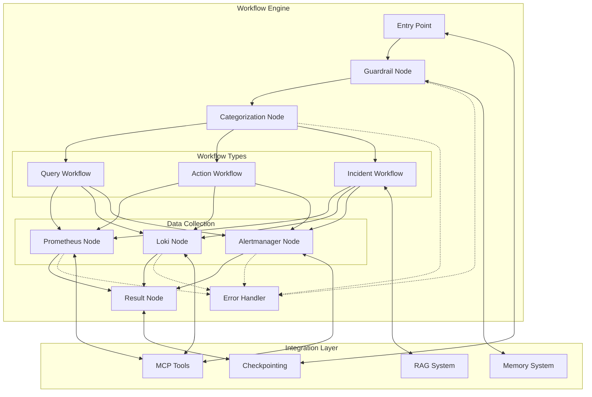

### Query Workflow Data Flow
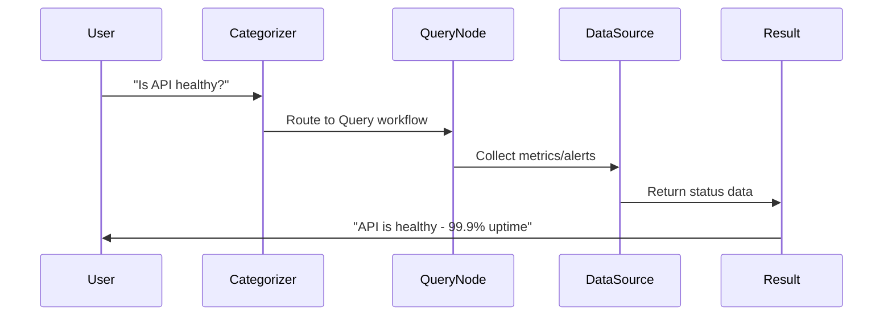

### Action Workflow Data Flow
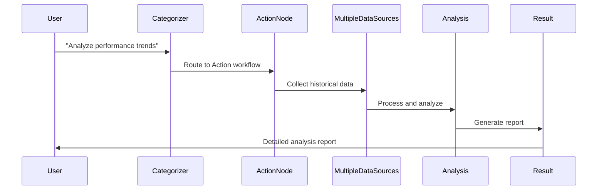

### Incident Workflow Data Flow
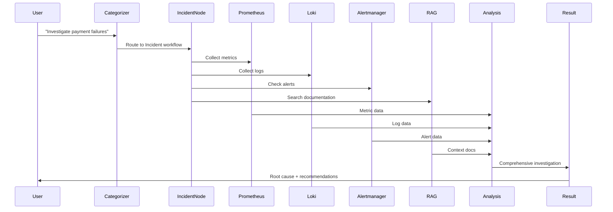

### Workflow State Transitions
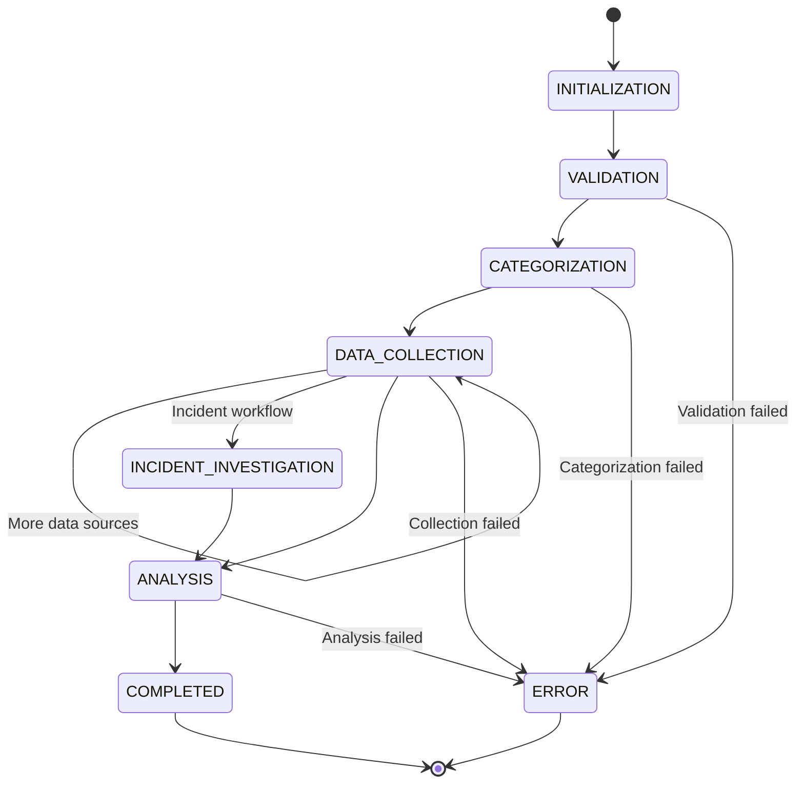

## Memory System

### Memory System Architecture
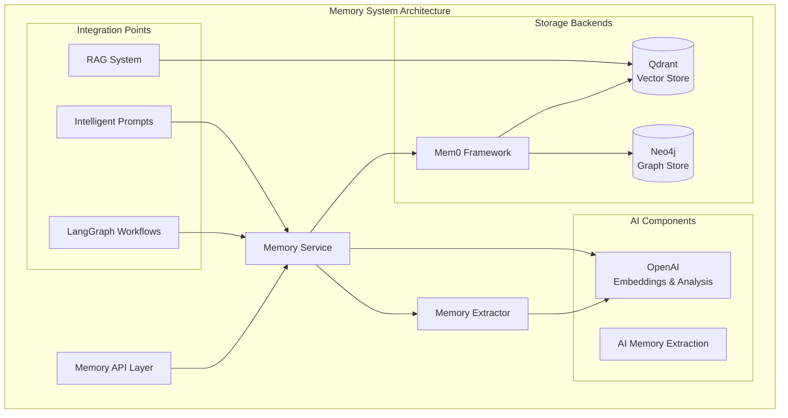

### Memory-Enhanced Workflows
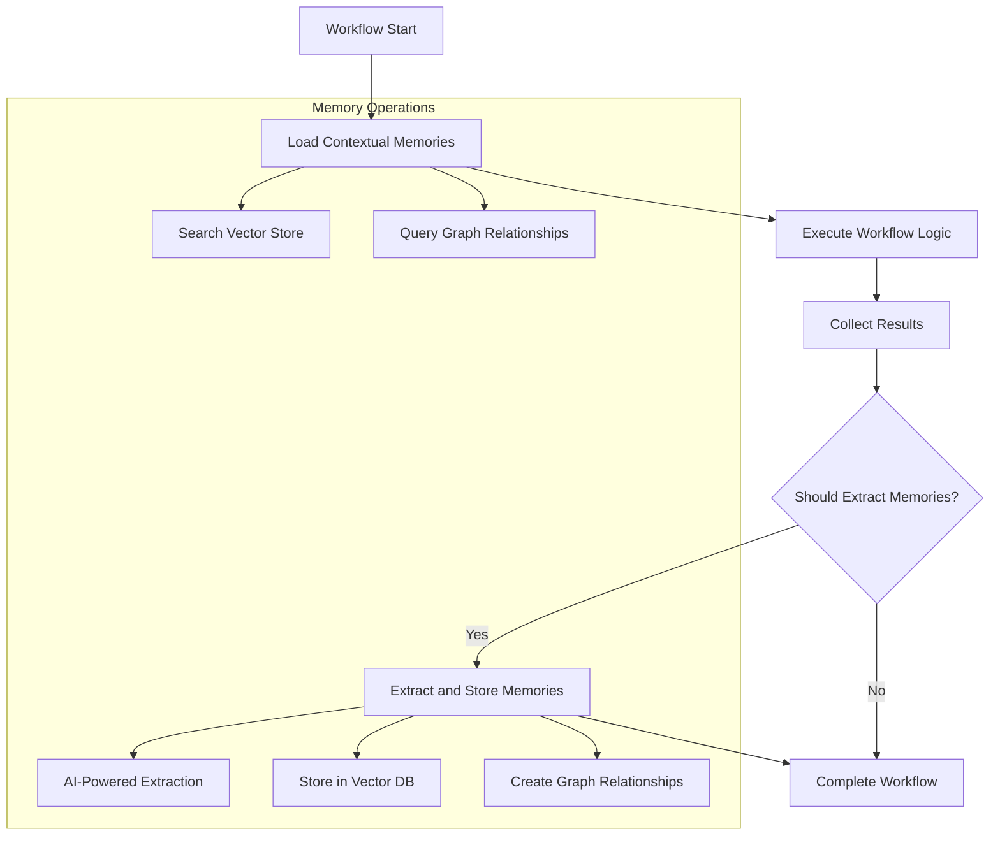

## RAG System

### RAG Architecture
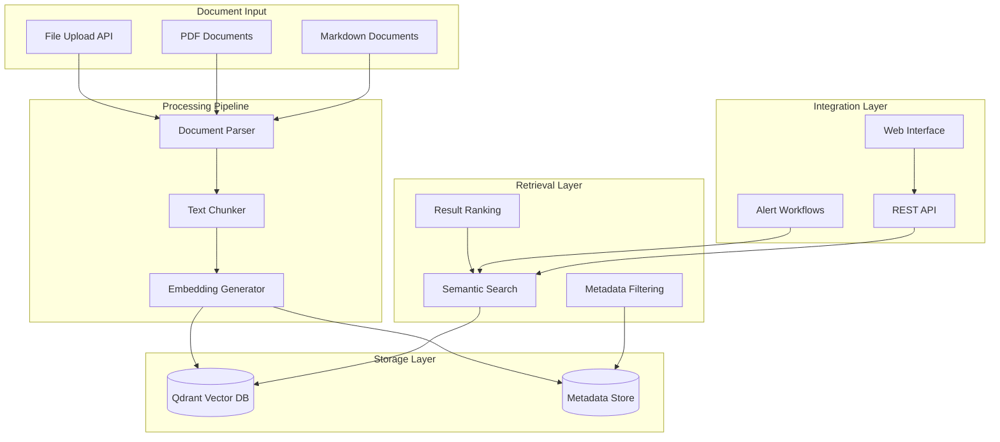

## Monitoring Integration

### Monitoring Stack Architecture
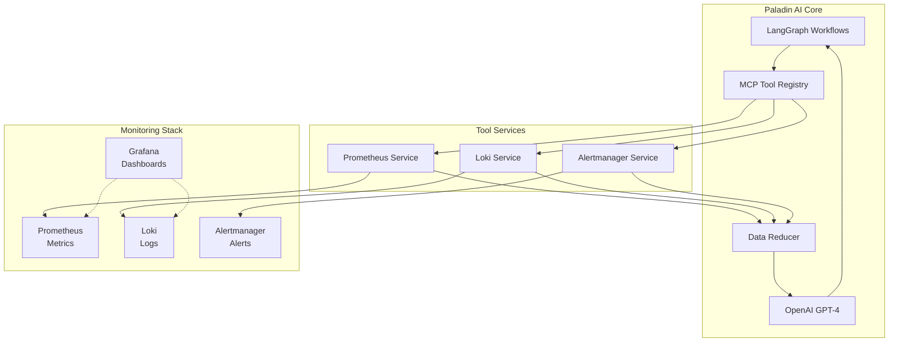

### Data Reduction Flow
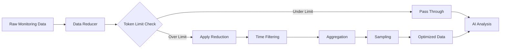

### MCP Tools Architecture
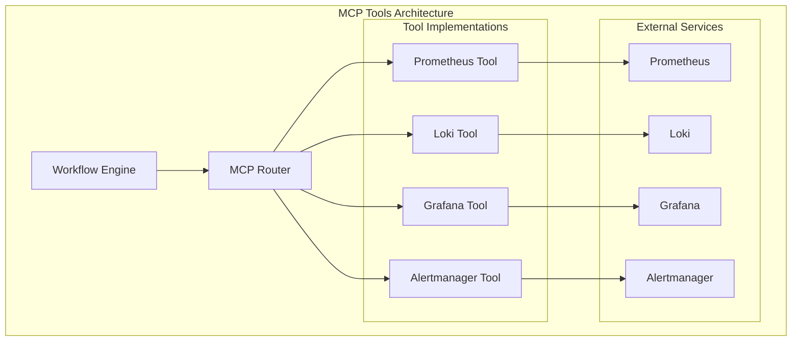

### Workflow Execution Flow
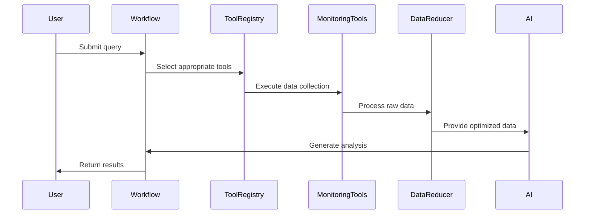

## Frontend Architecture

### Frontend Data Flow
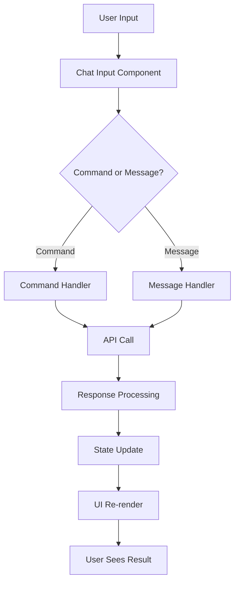

## Data Flows

### User Interaction Flow
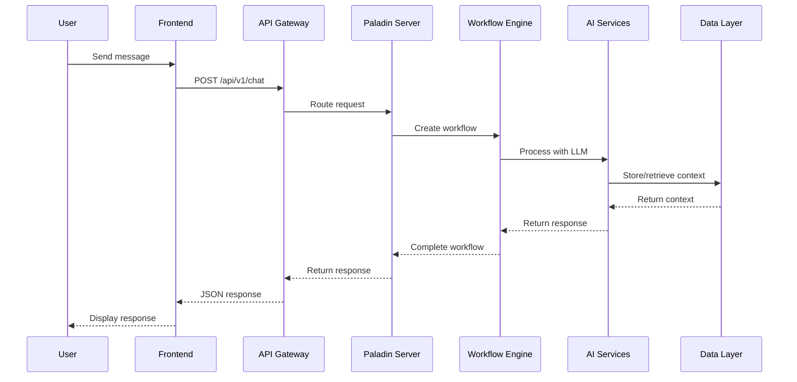

### Document Processing Flow
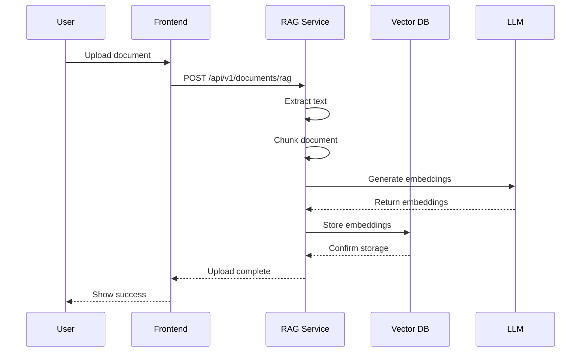

### Monitoring Query Flow
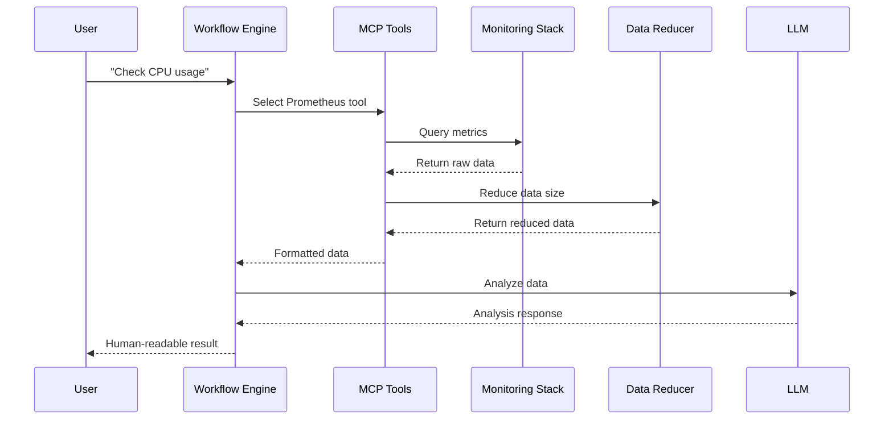

## Security Architecture

### Authentication & Authorization
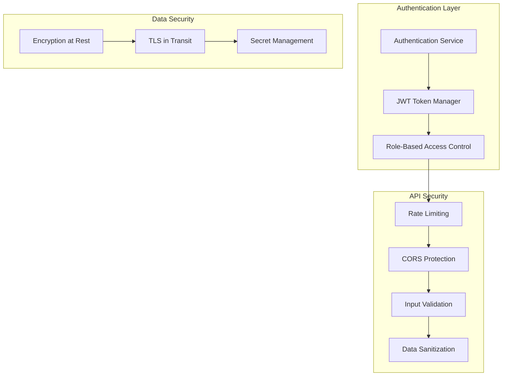

## Performance & Scalability

### Horizontal Scaling
```mermaid
graph TB
    subgraph "Horizontal Scaling"
        LB[Load Balancer]
        APP1[App Instance 1]
        APP2[App Instance 2]
        APP3[App Instance 3]
    end
    
    subgraph "Caching Strategy"
        CACHE[Valkey Cache]
        CDN[CDN Layer]
        BROWSER[Browser Cache]
    end
    
    subgraph "Database Scaling"
        MONGO_PRIMARY[MongoDB Primary]
        MONGO_SECONDARY[MongoDB Secondary]
        VECTOR_CLUSTER[Qdrant Cluster]
    end
    
    LB --> APP1
    LB --> APP2
    LB --> APP3
    
    APP1 --> CACHE
    APP2 --> CACHE
    APP3 --> CACHE
    
    CACHE --> MONGO_PRIMARY
    MONGO_PRIMARY --> MONGO_SECONDARY
    CACHE --> VECTOR_CLUSTER
```

## Observability

### System Monitoring
```mermaid
graph TB
    subgraph "Application Metrics"
        APP_METRICS[Application Metrics]
        CUSTOM_METRICS[Custom Metrics]
        BUSINESS_METRICS[Business Metrics]
    end
    
    subgraph "Infrastructure Metrics"
        SYSTEM_METRICS[System Metrics]
        CONTAINER_METRICS[Container Metrics]
        NETWORK_METRICS[Network Metrics]
    end
    
    subgraph "Logging"
        APP_LOGS[Application Logs]
        ACCESS_LOGS[Access Logs]
        ERROR_LOGS[Error Logs]
    end
    
    subgraph "Tracing"
        DISTRIBUTED_TRACING[Distributed Tracing]
        SPAN_TRACKING[Span Tracking]
        CORRELATION_IDS[Correlation IDs]
    end
    
    APP_METRICS --> PROMETHEUS[Prometheus]
    CUSTOM_METRICS --> PROMETHEUS
    BUSINESS_METRICS --> PROMETHEUS
    
    SYSTEM_METRICS --> PROMETHEUS
    CONTAINER_METRICS --> PROMETHEUS
    NETWORK_METRICS --> PROMETHEUS
    
    APP_LOGS --> LOKI[Loki]
    ACCESS_LOGS --> LOKI
    ERROR_LOGS --> LOKI
    
    DISTRIBUTED_TRACING --> JAEGER[Jaeger]
    SPAN_TRACKING --> JAEGER
    CORRELATION_IDS --> JAEGER
```

---

*This document contains all the architectural diagrams from the Paladin AI documentation. Each diagram provides a visual representation of the system's components, data flows, and interactions to help understand the overall architecture and design decisions.*