# 🏗️ Architecture Documentation

Comprehensive system design and component overview for Paladin AI platform.

## System Overview

Paladin AI is a distributed AI-powered monitoring and incident response platform built with modern microservices architecture. The platform integrates multiple AI technologies with existing monitoring infrastructure to provide intelligent analysis and automated response capabilities.

### High-Level Architecture

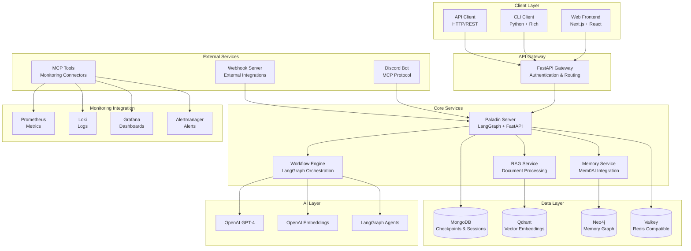

## Core Components

### 1. Client Layer

#### Web Frontend (Next.js)
- **Technology**: Next.js 14, React 18, TypeScript
- **Features**: 
  - Real-time chat interface
  - Session management
  - Document upload/processing
  - Dark/light theme support
  - Responsive design
- **Architecture**: Server-side rendering with client-side hydration
- **State Management**: Zustand for global state
- **Communication**: REST API with WebSocket fallback

#### CLI Client (Python)
- **Technology**: Python 3.13, Rich terminal library
- **Features**:
  - Interactive chat sessions
  - Command history
  - File upload capabilities
  - Syntax highlighting
  - Progress indicators
- **Architecture**: Async Python client with rich terminal UI
- **Communication**: HTTP/REST API with streaming support

### 2. API Gateway

#### FastAPI Gateway
- **Technology**: FastAPI, Pydantic, AsyncIO
- **Responsibilities**:
  - Request routing
  - Authentication/authorization
  - Rate limiting
  - Request validation
  - Response formatting
- **Middleware**:
  - CORS handling
  - Request logging
  - Error handling
  - Security headers
- **Performance**: Async/await throughout, connection pooling

### 3. Core Services

#### Paladin Server
- **Technology**: FastAPI, LangGraph, AsyncIO
- **Architecture**: Event-driven microservice
- **Components**:
  - **API Routes**: RESTful endpoints
  - **Workflow Manager**: LangGraph orchestration
  - **Session Manager**: Checkpoint persistence
  - **Tool Manager**: MCP tool integration
  - **Memory Manager**: Long-term context storage

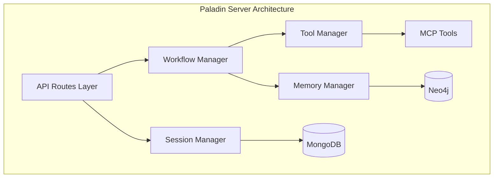

#### Workflow Engine (LangGraph)
- **Technology**: LangGraph, LangChain, OpenAI
- **Architecture**: State machine-based workflow orchestration
- **Workflow Types**:
  - **Query Workflows**: Simple Q&A interactions
  - **Incident Workflows**: Complex investigation processes
  - **Action Workflows**: Automated response execution
- **Features**:
  - Conditional routing
  - Parallel execution
  - Error handling and recovery
  - Checkpoint persistence
  - Tool integration

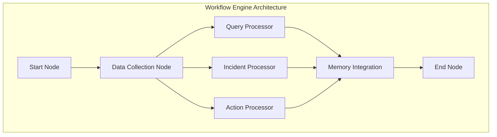

#### Memory Service (Mem0AI)
- **Technology**: Mem0AI, Neo4j, Vector embeddings
- **Architecture**: Graph-based memory storage
- **Features**:
  - Entity relationship mapping
  - Contextual memory retrieval
  - Learning from interactions
  - Memory decay and importance scoring
- **Integration**: Seamless LangGraph integration

#### RAG Service
- **Technology**: Qdrant, OpenAI Embeddings, LangChain
- **Architecture**: Vector-based document retrieval
- **Pipeline**:
  1. Document ingestion
  2. Text chunking
  3. Embedding generation
  4. Vector storage
  5. Similarity search
  6. Context retrieval

### 4. Data Layer

#### MongoDB (Document Store)
- **Usage**: Session checkpoints, user data, configurations
- **Schema Design**:
  - **Collections**: `checkpoints`, `sessions`, `documents`, `users`
  - **Indexes**: Session-based, time-based, user-based
- **Features**: 
  - Automatic checkpointing
  - Session persistence
  - Document metadata

#### Qdrant (Vector Database)
- **Usage**: Document embeddings, semantic search
- **Collections**: 
  - `paladin-docs`: Document embeddings
  - `paladin-memories`: Memory embeddings
- **Features**:
  - Cosine similarity search
  - Metadata filtering
  - Payload storage

#### Neo4j (Graph Database)
- **Usage**: Memory relationships, entity graphs
- **Schema**:
  - **Nodes**: `Memory`, `Entity`, `Relationship`
  - **Edges**: `RELATES_TO`, `CONTAINS`, `TRIGGERS`
- **Features**:
  - Graph traversal
  - Pattern matching
  - Relationship inference

#### Valkey (Cache)
- **Usage**: Session caching, response caching, rate limiting
- **Features**:
  - Redis-compatible protocol
  - Pub/Sub messaging
  - Distributed caching

### 5. Monitoring Integration

#### MCP Tools Architecture
- **Technology**: Model Context Protocol (MCP)
- **Architecture**: Plugin-based tool system
- **Available Tools**:
  - **Prometheus**: Metrics querying
  - **Loki**: Log aggregation
  - **Grafana**: Dashboard integration
  - **Alertmanager**: Alert management

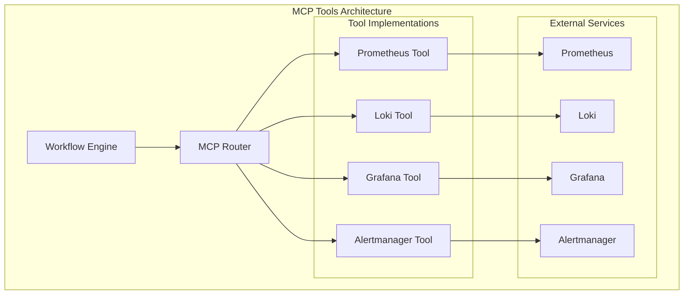

### 6. External Services

#### Discord Integration
- **Technology**: Discord.py, MCP Protocol
- **Architecture**: Bot with MCP server integration
- **Features**:
  - Channel monitoring
  - Command processing
  - Alert forwarding
  - Interactive responses

#### Webhook Server
- **Technology**: FastAPI, Async processing
- **Purpose**: External alert ingestion
- **Features**:
  - Multi-format support
  - Authentication
  - Rate limiting
  - Processing queues

## Data Flow Architecture

### 1. User Interaction Flow

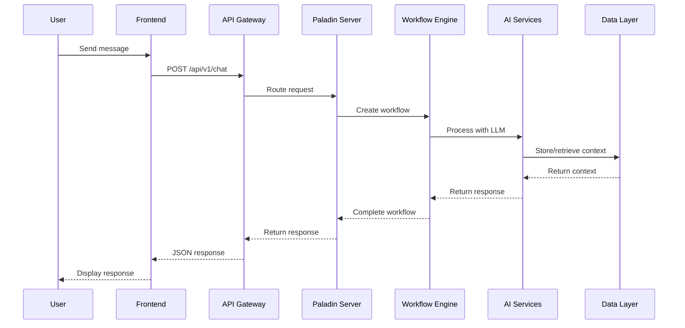

### 2. Document Processing Flow

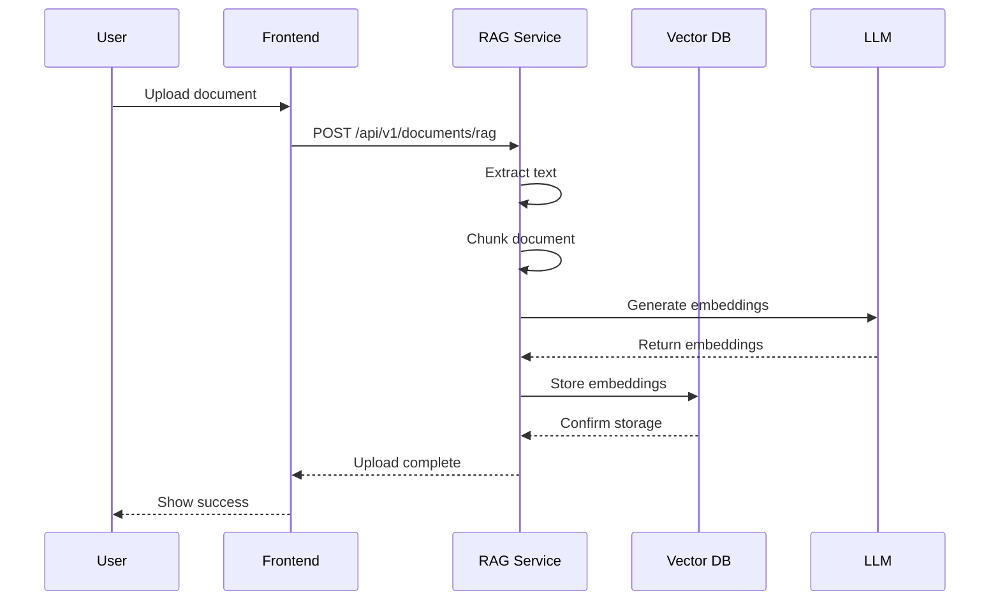

### 3. Monitoring Query Flow

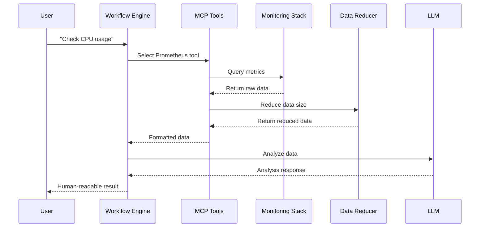

## Security Architecture

### 1. Authentication & Authorization

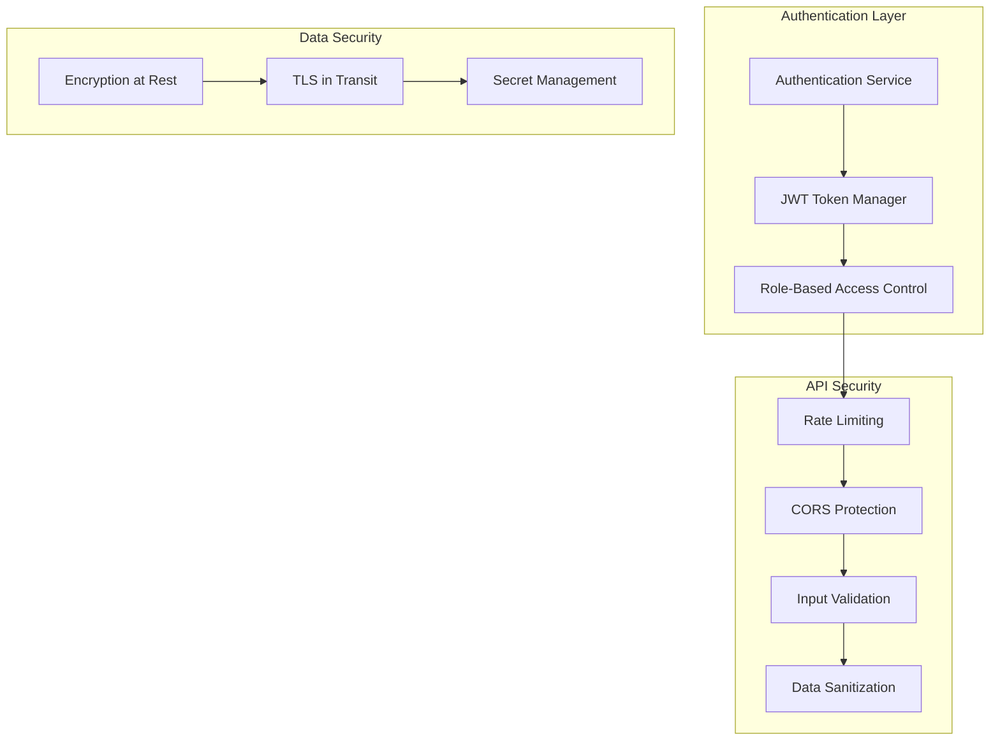

### 2. Security Layers

1. **Transport Security**
   - TLS 1.3 for all communications
   - Certificate pinning
   - HSTS headers

2. **API Security**
   - JWT authentication
   - Rate limiting per endpoint
   - Input validation/sanitization
   - SQL injection prevention

3. **Data Security**
   - Encryption at rest (AES-256)
   - Encryption in transit (TLS)
   - Secret management (environment variables)
   - Database access controls

## Performance Architecture

### 1. Scalability Patterns

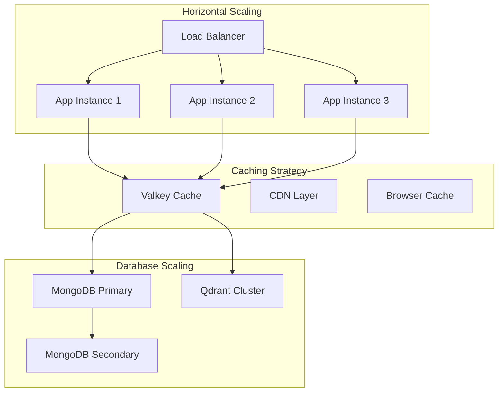

### 2. Performance Optimizations

1. **Async Processing**
   - FastAPI async/await
   - Connection pooling
   - Batch processing

2. **Caching Strategy**
   - Response caching
   - Query result caching
   - Session caching

3. **Data Reduction**
   - Intelligent data sampling
   - Token limit management
   - Compression algorithms

## Deployment Architecture

### 1. Container Architecture

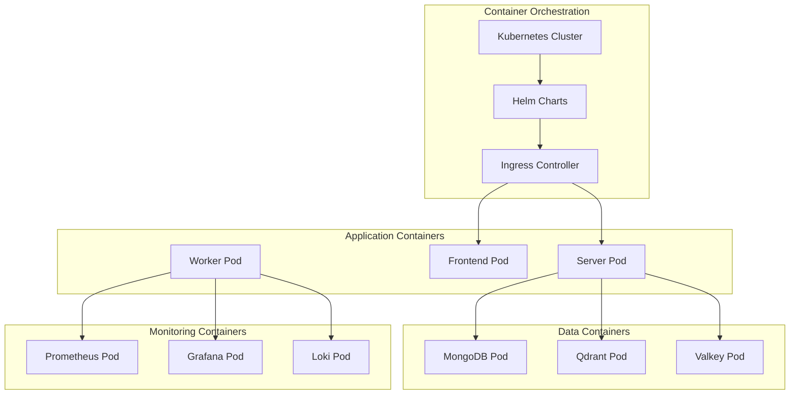

### 2. Environment Architecture

1. **Development Environment**
   - Local Docker Compose
   - Hot reloading
   - Mock services

2. **Staging Environment**
   - Kubernetes cluster
   - Full service mesh
   - Integration testing

3. **Production Environment**
   - Multi-region deployment
   - Auto-scaling
   - Disaster recovery

## Monitoring & Observability

### 1. System Monitoring

```mermaid
graph TB
    subgraph "Application Metrics"
        APP_METRICS[Application Metrics]
        CUSTOM_METRICS[Custom Metrics]
        BUSINESS_METRICS[Business Metrics]
    end
    
    subgraph "Infrastructure Metrics"
        SYSTEM_METRICS[System Metrics]
        CONTAINER_METRICS[Container Metrics]
        NETWORK_METRICS[Network Metrics]
    end
    
    subgraph "Logging"
        APP_LOGS[Application Logs]
        ACCESS_LOGS[Access Logs]
        ERROR_LOGS[Error Logs]
    end
    
    subgraph "Tracing"
        DISTRIBUTED_TRACING[Distributed Tracing]
        SPAN_TRACKING[Span Tracking]
        CORRELATION_IDS[Correlation IDs]
    end
    
    APP_METRICS --> PROMETHEUS[Prometheus]
    CUSTOM_METRICS --> PROMETHEUS
    BUSINESS_METRICS --> PROMETHEUS
    
    SYSTEM_METRICS --> PROMETHEUS
    CONTAINER_METRICS --> PROMETHEUS
    NETWORK_METRICS --> PROMETHEUS
    
    APP_LOGS --> LOKI[Loki]
    ACCESS_LOGS --> LOKI
    ERROR_LOGS --> LOKI
    
    DISTRIBUTED_TRACING --> JAEGER[Jaeger]
    SPAN_TRACKING --> JAEGER
    CORRELATION_IDS --> JAEGER
```

### 2. Observability Stack

1. **Metrics Collection**: Prometheus with custom exporters
2. **Log Aggregation**: Loki with structured logging
3. **Distributed Tracing**: Jaeger with OpenTelemetry
4. **Alerting**: Alertmanager with multiple channels
5. **Dashboards**: Grafana with custom panels

## Technology Decisions

### 1. Language & Framework Choices

| Component | Technology | Rationale |
|-----------|------------|-----------|
| Backend | Python 3.13 + FastAPI | Async performance, AI ecosystem |
| Frontend | Next.js + TypeScript | SSR, developer experience |
| CLI | Python + Rich | Native integration, beautiful UIs |
| Database | MongoDB | Document flexibility, horizontal scaling |
| Vector DB | Qdrant | Performance, feature completeness |
| Cache | Valkey | Redis compatibility, open source |
| Orchestration | LangGraph | AI workflow orchestration |
| Monitoring | Prometheus Stack | Industry standard, comprehensive |

### 2. Architectural Patterns

1. **Microservices**: Service decomposition for scalability
2. **Event-Driven**: Async processing for performance
3. **CQRS**: Command/Query separation for optimization
4. **Saga Pattern**: Distributed transaction handling
5. **Circuit Breaker**: Fault tolerance and resilience

## Future Architecture Considerations

### 1. Scalability Roadmap

1. **Phase 1**: Horizontal scaling with load balancers
2. **Phase 2**: Microservices decomposition
3. **Phase 3**: Event-driven architecture
4. **Phase 4**: Multi-region deployment

### 2. Technology Evolution

1. **AI Integration**: Enhanced LLM capabilities
2. **Edge Computing**: Distributed processing
3. **Streaming**: Real-time data processing
4. **Serverless**: Function-as-a-Service adoption

---

This architecture provides a robust foundation for the Paladin AI platform while maintaining flexibility for future enhancements and scaling requirements.