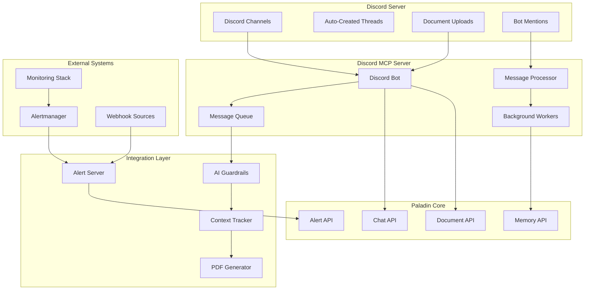

# 🤖 Discord Integration Guide

Comprehensive guide to integrating Paladin AI with Discord for team collaboration and automated monitoring.

## Overview

The Paladin AI Discord integration provides a sophisticated bot system that bridges Discord communities with the Paladin AI monitoring platform. Built using the Model Context Protocol (MCP), it enables seamless team collaboration, automated alert processing, intelligent document management, and real-time monitoring insights directly within Discord channels.

## Architecture Overview



## Quick Setup

### 1. Discord Bot Creation

```bash
# 1. Create Discord Application
# Go to https://discord.com/developers/applications
# Click "New Application" and name it "Paladin AI"

# 2. Create Bot User
# Navigate to "Bot" section
# Click "Add Bot"
# Copy the bot token (keep it secure!)

# 3. Configure Bot Permissions
# Navigate to "OAuth2 > URL Generator"
# Select "bot" scope
# Select required permissions:
#   - Send Messages
#   - Read Messages/View Channels
#   - Read Message History
#   - Create Public Threads
#   - Use Slash Commands
#   - Attach Files
#   - Add Reactions
```

### 2. Environment Configuration

```bash
# Discord Configuration
export DISCORD_BOT_TOKEN="your-discord-bot-token"
export DISCORD_ENABLED=true
export DISCORD_MCP_HOST=0.0.0.0
export DISCORD_MCP_PORT=9000

# Queue Configuration (Redis/Valkey)
export VALKEY_HOST=localhost
export VALKEY_PORT=6379
export VALKEY_DB=0

# AI Configuration
export OPENAI_API_KEY="your-openai-api-key"
export OPENAI_MODEL=gpt-4o-mini

# Server Integration
export SERVER_HOST=127.0.0.1
export SERVER_PORT=8000
```

### 3. Start Discord Integration

```bash
# Start MCP Discord server
cd mcp/discord-server
python enhanced_server.py

# Start message processing workers
python workers_server.py

# Start alert server
python alert_server.py
```

### 4. Invite Bot to Server

```bash
# Use the OAuth2 URL generated in step 1
# Example URL format:
https://discord.com/api/oauth2/authorize?client_id=YOUR_CLIENT_ID&permissions=2048&scope=bot
```

## Core Features

### 1. Intelligent Message Processing

#### AI-Powered Guardrails
The bot uses AI to determine message relevance to monitoring and DevOps operations:

```python
# Guardrail system
async def should_process_message(message_content: str) -> bool:
    """Determine if message is relevant to Paladin operations"""
    
    # Check for monitoring keywords
    monitoring_keywords = [
        "alert", "monitoring", "prometheus", "grafana", "kubernetes",
        "incident", "outage", "performance", "metrics", "logs",
        "error", "failure", "downtime", "latency", "throughput"
    ]
    
    # AI-powered relevance check
    relevance_prompt = f"""
    Determine if this Discord message is relevant to monitoring, observability, 
    or infrastructure operations: "{message_content}"
    
    Return a confidence score (0-1) and brief reasoning.
    """
    
    response = await openai_client.chat.completions.create(
        model="gpt-4o-mini",
        messages=[{"role": "user", "content": relevance_prompt}]
    )
    
    # Parse confidence score
    confidence = extract_confidence(response.choices[0].message.content)
    return confidence > PROCESSING_THRESHOLD
```

#### Context Tracking
- **Thread Context**: Maintains conversation context within threads
- **Reply Chains**: Tracks message reply relationships
- **User History**: Preserves user conversation history
- **Channel Monitoring**: Monitors specified channels for relevant messages

### 2. Bot Mention Handling

#### Interactive Conversations
```python
# When bot is mentioned
@bot.event
async def on_message(message):
    if bot.user.mentioned_in(message):
        # Create thread for conversation
        thread = await message.create_thread(
            name=f"Chat with {message.author.display_name}",
            auto_archive_duration=60
        )
        
        # Generate acknowledgment
        ack_message = await generate_acknowledgment(message.content)
        await thread.send(ack_message)
        
        # Process with Paladin AI
        response = await process_with_paladin(message.content, thread.id)
        
        # Offer format choice
        format_message = await thread.send(
            "How would you like the response?",
            view=FormatChoiceView()
        )
```

#### Format Options
Users can choose response format:
- **Discord Text**: Formatted text response in Discord
- **PDF Report**: Downloadable PDF with comprehensive analysis

### 3. Document Management

#### Automatic Document Processing
```python
# Document upload handler
@bot.event
async def on_message(message):
    if message.channel.name == "docs" and message.attachments:
        for attachment in message.attachments:
            if attachment.filename.endswith(('.pdf', '.md', '.markdown')):
                # Download and process document
                file_data = await attachment.read()
                
                # Upload to Paladin RAG system
                result = await upload_to_paladin_rag(
                    file_data=file_data,
                    filename=attachment.filename
                )
                
                # Confirm processing
                await message.add_reaction("✅")
                await message.reply(
                    f"📄 Document processed: {result['chunks_created']} chunks created"
                )
```

#### Supported Formats
- **PDF Documents**: Technical documentation, runbooks, procedures
- **Markdown Files**: README files, documentation, guides
- **Automatic Indexing**: Documents become searchable via RAG system

### 4. Alert Integration

#### Real-time Alert Forwarding
```python
# Alert server for receiving Paladin alerts
@app.post("/alert-report")
async def receive_alert_report(alert_data: dict):
    """Receive alert analysis from Paladin server"""
    
    # Format alert for Discord
    embed = create_alert_embed(alert_data)
    
    # Send to alerts channel
    alerts_channel = bot.get_channel(ALERTS_CHANNEL_ID)
    message = await alerts_channel.send(embed=embed)
    
    # Offer PDF report option
    await message.add_reaction("📄")
    
    return {"status": "alert_forwarded", "message_id": message.id}
```

#### Alert Embed Format
```python
def create_alert_embed(alert_data: dict) -> discord.Embed:
    """Create rich Discord embed for alerts"""
    
    severity = alert_data.get("severity", "unknown")
    
    # Color coding by severity
    color_map = {
        "critical": 0xFF0000,  # Red
        "warning": 0xFFA500,   # Orange
        "info": 0x0099FF       # Blue
    }
    
    embed = discord.Embed(
        title=f"🚨 {alert_data['alertname']}",
        description=alert_data.get("description", ""),
        color=color_map.get(severity, 0x808080),
        timestamp=datetime.now()
    )
    
    # Add fields
    embed.add_field(
        name="Severity",
        value=severity.title(),
        inline=True
    )
    
    embed.add_field(
        name="Service",
        value=alert_data.get("service", "Unknown"),
        inline=True
    )
    
    embed.add_field(
        name="Analysis",
        value=alert_data.get("analysis", "Processing..."),
        inline=False
    )
    
    return embed
```

## MCP Tools Reference

### 1. Channel Operations

#### Get Channel Messages
```python
# Retrieve recent messages from channel
messages = await mcp_client.call_tool(
    "get_channel_messages",
    {
        "channel_id": "123456789",
        "limit": 50,
        "include_context": True
    }
)
```

#### Send Message
```python
# Send message to channel or thread
response = await mcp_client.call_tool(
    "send_message",
    {
        "channel_id": "123456789",
        "content": "Hello from Paladin AI!",
        "reply_to": "987654321"  # Optional reply
    }
)
```

### 2. Thread Operations

#### Get Thread Messages
```python
# Retrieve complete thread conversation
thread_messages = await mcp_client.call_tool(
    "get_thread_messages",
    {
        "thread_id": "123456789",
        "include_context": True
    }
)
```

### 3. Context Operations

#### Get Conversation Context
```python
# Get user's conversation history
context = await mcp_client.call_tool(
    "get_conversation_context",
    {
        "user_id": "123456789",
        "limit": 10
    }
)
```

### 4. Monitoring Operations

#### Monitor Channel
```python
# Start/stop channel monitoring
result = await mcp_client.call_tool(
    "monitor_channel",
    {
        "channel_id": "123456789",
        "action": "start"  # or "stop"
    }
)
```

#### Queue Status
```python
# Check message processing queue
status = await mcp_client.call_tool(
    "get_queue_status",
    {}
)
```

## Configuration

### Bot Permissions Setup

#### Required Permissions
```json
{
  "permissions": [
    "VIEW_CHANNEL",
    "SEND_MESSAGES",
    "READ_MESSAGE_HISTORY",
    "CREATE_PUBLIC_THREADS",
    "USE_APPLICATION_COMMANDS",
    "ATTACH_FILES",
    "ADD_REACTIONS",
    "EMBED_LINKS"
  ]
}
```

#### Channel Setup
```yaml
# Recommended channel structure
channels:
  - name: "general"
    purpose: "General team communication"
    monitoring: true
    
  - name: "alerts"
    purpose: "Automated alert notifications"
    monitoring: false
    bot_only: true
    
  - name: "docs"
    purpose: "Document uploads and processing"
    monitoring: true
    auto_process: true
    
  - name: "incidents"
    purpose: "Incident response coordination"
    monitoring: true
    priority: high
```

### Advanced Configuration

#### Guardrail Settings
```python
# Configure message processing thresholds
GUARDRAIL_CONFIG = {
    "confidence_threshold": 0.7,
    "keyword_boost": 0.2,
    "user_whitelist": ["admin", "sre-team"],
    "channel_specific_thresholds": {
        "incidents": 0.5,  # Lower threshold for incident channel
        "general": 0.8     # Higher threshold for general chat
    }
}
```

#### Queue Configuration
```python
# Message processing queue settings
QUEUE_CONFIG = {
    "max_queue_size": 1000,
    "worker_count": 3,
    "retry_attempts": 3,
    "retry_delay": 5,  # seconds
    "batch_size": 10
}
```

## Usage Examples

### 1. Team Monitoring Setup

```bash
# 1. Create Discord server with recommended channels
# 2. Invite Paladin bot with proper permissions
# 3. Configure channel monitoring

# Start monitoring key channels
@paladin monitor #incidents
@paladin monitor #general
```

### 2. Interactive Troubleshooting

```discord
# User mentions bot in #incidents channel
@paladin The payment service is showing high latency. Can you investigate?

# Bot creates thread and responds:
Thread: "Chat with john_doe"
Bot: "I'll investigate the payment service latency issue. Checking metrics and logs now..."

# Bot offers format choice:
Bot: "How would you like the response?"
[Text Response] [PDF Report]

# User clicks "PDF Report", receives comprehensive analysis
```

### 3. Document Upload and Processing

```discord
# User uploads document to #docs channel
User: *uploads "kubernetes-troubleshooting-guide.pdf"*

# Bot automatically processes:
Bot: ✅ (reaction)
Bot: "📄 Document processed: kubernetes-troubleshooting-guide.pdf
     • 25 chunks created
     • Available for search queries
     • Added to knowledge base"
```

### 4. Alert Notifications

```discord
# Automatic alert from monitoring system
#alerts channel:
Bot: 🚨 **High CPU Usage - Web Servers**
     Severity: Warning
     Service: web-frontend
     Analysis: CPU usage has exceeded 80% threshold on 3/5 web servers...
     📄 (reaction for PDF report)
```

## Advanced Features

### 1. PDF Report Generation

```python
class PDFReportGenerator:
    def __init__(self):
        self.canvas = canvas.Canvas
        self.styles = getSampleStyleSheet()
    
    async def generate_alert_report(self, alert_data: dict) -> bytes:
        """Generate comprehensive PDF alert report"""
        
        buffer = BytesIO()
        doc = SimpleDocTemplate(buffer, pagesize=letter)
        story = []
        
        # Title
        title_style = self.styles['Title']
        title = Paragraph(f"Alert Analysis Report: {alert_data['alertname']}", title_style)
        story.append(title)
        story.append(Spacer(1, 12))
        
        # Alert details
        details_data = [
            ['Severity', alert_data.get('severity', 'Unknown')],
            ['Service', alert_data.get('service', 'Unknown')],
            ['Timestamp', alert_data.get('timestamp', 'Unknown')],
            ['Status', alert_data.get('status', 'Unknown')]
        ]
        
        details_table = Table(details_data)
        details_table.setStyle(TableStyle([
            ('BACKGROUND', (0, 0), (-1, 0), colors.grey),
            ('TEXTCOLOR', (0, 0), (-1, 0), colors.whitesmoke),
            ('ALIGN', (0, 0), (-1, -1), 'CENTER'),
            ('FONTNAME', (0, 0), (-1, 0), 'Helvetica-Bold'),
            ('FONTSIZE', (0, 0), (-1, 0), 14),
            ('BOTTOMPADDING', (0, 0), (-1, 0), 12),
            ('BACKGROUND', (0, 1), (-1, -1), colors.beige),
            ('GRID', (0, 0), (-1, -1), 1, colors.black)
        ]))
        
        story.append(details_table)
        story.append(Spacer(1, 12))
        
        # Analysis section
        analysis_style = self.styles['Normal']
        analysis = Paragraph(alert_data.get('analysis', 'No analysis available'), analysis_style)
        story.append(analysis)
        
        # Build PDF
        doc.build(story)
        buffer.seek(0)
        return buffer.getvalue()
```

### 2. Context-Aware Responses

```python
async def generate_contextual_response(
    message: discord.Message,
    thread_context: List[dict]
) -> str:
    """Generate response considering full conversation context"""
    
    # Build context from thread
    context_messages = []
    for msg in thread_context:
        context_messages.append({
            "role": "user" if msg["author_id"] != bot.user.id else "assistant",
            "content": msg["content"]
        })
    
    # Add current message
    context_messages.append({
        "role": "user",
        "content": message.content
    })
    
    # Generate contextual response
    response = await openai_client.chat.completions.create(
        model="gpt-4o-mini",
        messages=[
            {
                "role": "system",
                "content": "You are Paladin AI, a monitoring and DevOps assistant. Provide helpful responses based on the conversation context."
            }
        ] + context_messages
    )
    
    return response.choices[0].message.content
```

### 3. Smart Channel Routing

```python
class ChannelRouter:
    def __init__(self):
        self.channel_configs = {
            "alerts": {
                "auto_process": True,
                "create_threads": False,
                "confidence_threshold": 0.5
            },
            "incidents": {
                "auto_process": True,
                "create_threads": True,
                "confidence_threshold": 0.6,
                "priority": "high"
            },
            "docs": {
                "auto_process": True,
                "process_uploads": True,
                "create_threads": False
            }
        }
    
    async def route_message(self, message: discord.Message) -> dict:
        """Route message based on channel configuration"""
        
        channel_name = message.channel.name
        config = self.channel_configs.get(channel_name, {})
        
        routing_decision = {
            "should_process": config.get("auto_process", False),
            "create_thread": config.get("create_threads", True),
            "confidence_threshold": config.get("confidence_threshold", 0.7),
            "priority": config.get("priority", "normal")
        }
        
        return routing_decision
```

## Security and Best Practices

### 1. Token Security

```python
# Secure token management
import os
from cryptography.fernet import Fernet

class SecureConfig:
    def __init__(self):
        self.encryption_key = os.environ.get('DISCORD_ENCRYPTION_KEY')
        self.cipher = Fernet(self.encryption_key.encode()) if self.encryption_key else None
    
    def get_bot_token(self) -> str:
        """Securely retrieve Discord bot token"""
        encrypted_token = os.environ.get('DISCORD_BOT_TOKEN_ENCRYPTED')
        
        if encrypted_token and self.cipher:
            return self.cipher.decrypt(encrypted_token.encode()).decode()
        else:
            return os.environ.get('DISCORD_BOT_TOKEN')
```

### 2. Rate Limiting

```python
from asyncio import Semaphore
from time import time

class RateLimiter:
    def __init__(self, max_requests: int = 50, time_window: int = 60):
        self.max_requests = max_requests
        self.time_window = time_window
        self.requests = []
        self.semaphore = Semaphore(max_requests)
    
    async def acquire(self):
        """Acquire rate limit permission"""
        async with self.semaphore:
            current_time = time()
            
            # Remove old requests
            self.requests = [req_time for req_time in self.requests 
                           if current_time - req_time < self.time_window]
            
            if len(self.requests) >= self.max_requests:
                sleep_time = self.time_window - (current_time - self.requests[0])
                await asyncio.sleep(sleep_time)
            
            self.requests.append(current_time)
```

### 3. Input Validation

```python
def validate_discord_input(content: str) -> dict:
    """Validate and sanitize Discord message content"""
    
    validation_result = {
        "valid": True,
        "sanitized_content": content,
        "warnings": []
    }
    
    # Check length
    if len(content) > 2000:
        validation_result["valid"] = False
        validation_result["warnings"].append("Message too long")
    
    # Remove potential injection attempts
    dangerous_patterns = ['<script', 'javascript:', 'data:']
    for pattern in dangerous_patterns:
        if pattern.lower() in content.lower():
            validation_result["sanitized_content"] = content.replace(pattern, '[FILTERED]')
            validation_result["warnings"].append(f"Filtered dangerous pattern: {pattern}")
    
    # Validate mentions
    if '@everyone' in content or '@here' in content:
        validation_result["warnings"].append("Mass mention detected")
    
    return validation_result
```

## Monitoring and Observability

### 1. Bot Health Monitoring

```python
class BotHealthMonitor:
    def __init__(self, bot: discord.Bot):
        self.bot = bot
        self.health_metrics = {
            "messages_processed": 0,
            "errors_encountered": 0,
            "uptime_start": time(),
            "last_heartbeat": None
        }
    
    async def health_check(self) -> dict:
        """Comprehensive bot health check"""
        
        current_time = time()
        uptime = current_time - self.health_metrics["uptime_start"]
        
        health_status = {
            "status": "healthy" if self.bot.is_ready() else "unhealthy",
            "uptime_seconds": uptime,
            "guild_count": len(self.bot.guilds),
            "user_count": sum(guild.member_count for guild in self.bot.guilds),
            "messages_processed": self.health_metrics["messages_processed"],
            "error_rate": self.health_metrics["errors_encountered"] / max(1, self.health_metrics["messages_processed"]),
            "last_heartbeat": self.health_metrics["last_heartbeat"],
            "latency_ms": self.bot.latency * 1000
        }
        
        return health_status
    
    async def log_metrics(self):
        """Log performance metrics"""
        health = await self.health_check()
        logger.info(f"Bot Health: {health}")
```

### 2. Error Tracking

```python
import traceback
from typing import Optional

class ErrorTracker:
    def __init__(self):
        self.error_counts = {}
        self.recent_errors = []
    
    async def track_error(
        self, 
        error: Exception, 
        context: Optional[dict] = None
    ):
        """Track and log errors with context"""
        
        error_type = type(error).__name__
        error_message = str(error)
        
        # Count error types
        self.error_counts[error_type] = self.error_counts.get(error_type, 0) + 1
        
        # Store recent error
        error_info = {
            "type": error_type,
            "message": error_message,
            "traceback": traceback.format_exc(),
            "context": context,
            "timestamp": time()
        }
        
        self.recent_errors.append(error_info)
        
        # Keep only recent errors (last 100)
        if len(self.recent_errors) > 100:
            self.recent_errors = self.recent_errors[-100:]
        
        # Log error
        logger.error(f"Discord Bot Error: {error_type} - {error_message}", extra={
            "error_context": context,
            "traceback": traceback.format_exc()
        })
    
    def get_error_summary(self) -> dict:
        """Get error summary statistics"""
        return {
            "total_errors": sum(self.error_counts.values()),
            "error_types": self.error_counts,
            "recent_errors": self.recent_errors[-10:]  # Last 10 errors
        }
```

## Troubleshooting

### Common Issues

#### 1. Bot Not Responding

```bash
# Check bot status
curl http://localhost:9000/health

# Verify Discord token
python -c "
import discord
bot = discord.Bot()
@bot.event
async def on_ready():
    print(f'Bot is ready: {bot.user}')
bot.run('YOUR_BOT_TOKEN')
"

# Check permissions
# Ensure bot has required permissions in Discord server
```

#### 2. Message Processing Issues

```bash
# Check queue status
redis-cli -h localhost -p 6379 LLEN discord_message_queue

# Monitor worker logs
tail -f logs/discord-workers.log

# Test guardrail system
python -c "
from workers_server import should_process_message
result = should_process_message('test monitoring message')
print(f'Should process: {result}')
"
```

#### 3. Alert Forwarding Problems

```bash
# Test alert server
curl -X POST http://localhost:8001/alert-report \
  -H "Content-Type: application/json" \
  -d '{"alertname": "Test Alert", "severity": "warning"}'

# Check Discord channel permissions
# Verify bot can send messages to #alerts channel
```

#### 4. Document Processing Issues

```bash
# Test document upload
curl -X POST http://localhost:8000/api/v1/documents/upload \
  -F "file=@test-document.pdf"

# Check #docs channel monitoring
# Verify bot has file upload permissions
```

### Debug Commands

```bash
# Enable debug logging
export LOG_LEVEL=debug

# Test individual components
python enhanced_server.py --debug
python workers_server.py --test
python alert_server.py --health-check

# Monitor Discord API calls
export DISCORD_DEBUG=true
```

## Best Practices

### 1. Channel Organization

- **#alerts**: Dedicated channel for automated alert notifications
- **#docs**: Document upload and processing channel
- **#incidents**: High-priority incident response coordination
- **#general**: Team communication with selective monitoring

### 2. User Training

- **Bot Mentions**: Train users to mention bot for interactive help
- **Format Choices**: Educate on when to use text vs PDF responses
- **Document Upload**: Establish procedures for document management
- **Alert Response**: Define escalation procedures for critical alerts

### 3. Security

- **Token Rotation**: Regularly rotate Discord bot tokens
- **Permission Review**: Periodically review bot permissions
- **Content Filtering**: Monitor and filter inappropriate content
- **Access Control**: Implement role-based access where needed

### 4. Performance

- **Queue Monitoring**: Monitor message processing queue health
- **Rate Limiting**: Respect Discord API rate limits
- **Resource Usage**: Monitor memory and CPU usage
- **Error Handling**: Implement comprehensive error recovery

---

The Paladin AI Discord integration provides a powerful bridge between Discord communities and intelligent monitoring capabilities, enabling teams to collaborate effectively while maintaining automated oversight of their infrastructure and services.