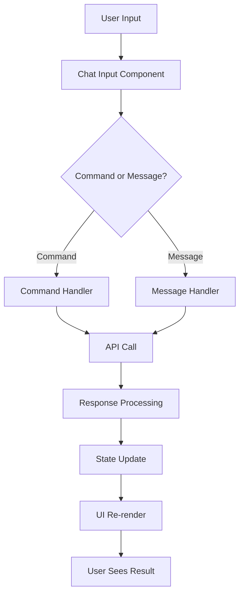

# 🌐 Frontend Documentation

Comprehensive guide to the Paladin AI Next.js frontend application.

## Overview

The Paladin AI frontend is a modern, responsive web application built with Next.js 14, TypeScript, and Tailwind CSS. It provides a Claude-style chat interface for interacting with the Paladin AI platform, complete with document upload, session management, and intelligent command processing.

## Architecture

### Technology Stack

| Component | Technology | Version | Purpose |
|-----------|------------|---------|---------|
| **Framework** | Next.js | 14+ | React framework with App Router |
| **Language** | TypeScript | Latest | Type-safe development |
| **Styling** | Tailwind CSS | v3 | Utility-first CSS framework |
| **UI Components** | shadcn/ui | Latest | Pre-built accessible components |
| **State Management** | Zustand | Latest | Lightweight state management |
| **HTTP Client** | Fetch API | Native | HTTP requests |
| **File Upload** | react-dropzone | Latest | Drag-and-drop file uploads |
| **Markdown** | react-markdown | Latest | Markdown rendering |
| **Themes** | next-themes | Latest | Dark/light theme support |

### Project Structure

```
frontend/
├── app/                        # Next.js App Router
│   ├── globals.css            # Global styles and Tailwind config
│   ├── layout.tsx             # Root layout with theme provider
│   ├── page.tsx               # Main application page
│   └── api/                   # API routes (if any)
├── components/                # React components
│   ├── chat-view.tsx          # Main chat interface
│   ├── chat-message.tsx       # Individual message component
│   ├── chat-input.tsx         # Message input with file upload
│   ├── sidebar.tsx            # Session list sidebar
│   └── ui/                    # shadcn/ui components
├── lib/                       # Utility libraries
│   ├── store.ts               # Zustand store
│   ├── utils.ts               # Utility functions
│   └── commands.ts            # Command processing logic
├── public/                    # Static assets
└── components.json            # shadcn/ui configuration
```

## Core Features

### 1. Chat Interface

#### Claude-Style Design
```typescript
// Components follow Claude's visual design patterns
const ChatMessage = ({ message, isUser }) => (
  <div className={`flex ${isUser ? 'justify-end' : 'justify-start'} mb-4`}>
    <div className={`max-w-[80%] rounded-lg px-4 py-2 ${
      isUser 
        ? 'bg-blue-500 text-white' 
        : 'bg-white dark:bg-gray-800 border border-gray-200 dark:border-gray-700'
    }`}>
      {message.content}
    </div>
  </div>
);
```

#### Real-time Communication
- Direct API communication with Paladin server
- Streaming responses for long operations
- Session-based conversation continuity
- Automatic retry for failed requests

### 2. Session Management

#### Smart Session Creation
```typescript
// Session creation logic
const handleSendMessage = async (content: string) => {
  let sessionId = currentSessionId;
  
  // Create new session if none exists
  if (!sessionId) {
    const title = content.replace(/\n/g, ' ').trim().substring(0, 50);
    sessionId = createSession(title || 'New Chat', false);
  }
  
  // Handle temporary sessions from commands
  const currentSession = getCurrentSession();
  if (currentSession?.isTemporary) {
    const title = content.replace(/\n/g, ' ').trim().substring(0, 50);
    makeSessionPermanent(sessionId, title || 'New Chat');
  }
};
```

#### Session Types
1. **Temporary Sessions**: Created by commands, auto-deleted
2. **Permanent Sessions**: Created by user messages, persistent
3. **Active Sessions**: Current conversation context

### 3. Command Processing

#### CLI-Style Commands
```typescript
// Command parsing and execution
const parseCommand = (input: string) => {
  const parts = input.trim().split(/\s+/);
  const command = parts[0];
  const subcommand = parts[1];
  const args = parts.slice(2);
  
  return { command, subcommand, args };
};

// Available commands
const commands = {
  '/memory': ['search', 'store', 'context', 'types', 'health'],
  '/checkpoint': ['get', 'list', 'delete', 'exists'],
  '/document': ['search', 'upload', 'health'],
  '/help': ['commands', 'usage']
};
```

#### Autocomplete System
- Context-aware command suggestions
- Intelligent argument completion
- Real-time validation
- Keyboard navigation support

### 4. Document Upload

#### Multiple Upload Methods
```typescript
// File upload handling
const handleFileUpload = async (files: File[]) => {
  for (const file of files) {
    const formData = new FormData();
    formData.append('file', file);
    
    const response = await fetch('/api/v1/documents/upload', {
      method: 'POST',
      body: formData
    });
    
    const result = await response.json();
    addMessage({
      role: 'system',
      content: `Document "${file.name}" uploaded successfully`
    });
  }
};
```

#### Supported Features
- **Drag & Drop**: Drop files anywhere on the interface
- **Button Upload**: Click paperclip icon to browse files
- **Progress Tracking**: Real-time upload progress
- **Error Handling**: Clear error messages for failed uploads

### 5. Theme System

#### Dark/Light Theme Support
```typescript
// Theme configuration with next-themes
const ThemeProvider = ({ children }) => (
  <NextThemesProvider
    attribute="class"
    defaultTheme="system"
    enableSystem
    disableTransitionOnChange
  >
    {children}
  </NextThemesProvider>
);
```

#### Theme Features
- **System Detection**: Automatic theme based on OS preference
- **Manual Toggle**: User can override system theme
- **Persistent Storage**: Theme preference saved locally
- **Smooth Transitions**: No flash of wrong theme

## State Management

### Zustand Store Architecture

```typescript
// Central state management
interface ChatStore {
  // Session Management
  sessions: ChatSession[];
  currentSessionId: string | null;
  
  // Message Management
  messages: Message[];
  
  // UI State
  isLoading: Record<string, boolean>;
  inputValues: Record<string, string>;
  
  // Actions
  createSession: (title: string, isTemporary?: boolean) => string;
  deleteSession: (sessionId: string) => void;
  makeSessionPermanent: (sessionId: string, title: string) => void;
  addMessage: (message: Message) => void;
  setLoading: (sessionId: string, loading: boolean) => void;
}
```

### Data Flow



## UI Components

### 1. ChatView Component

```typescript
// Main chat interface
const ChatView = () => {
  const { currentSession, messages, isLoading } = useChatStore();
  
  return (
    <div className="flex flex-col h-screen">
      {/* Header */}
      <div className="border-b border-gray-200 dark:border-gray-700 p-4">
        <h1 className="text-xl font-semibold">
          {currentSession?.title || 'Welcome to Paladin AI'}
        </h1>
      </div>
      
      {/* Messages */}
      <div className="flex-1 overflow-y-auto p-4">
        {messages.map((message, index) => (
          <ChatMessage key={index} message={message} />
        ))}
      </div>
      
      {/* Input */}
      <div className="border-t border-gray-200 dark:border-gray-700 p-4">
        <ChatInput />
      </div>
    </div>
  );
};
```

### 2. ChatMessage Component

```typescript
// Individual message rendering
const ChatMessage = ({ message }: { message: Message }) => {
  const isUser = message.role === 'user';
  const isCommand = message.role === 'command';
  
  return (
    <div className={`flex ${isUser ? 'justify-end' : 'justify-start'} mb-4`}>
      <div className={`max-w-[80%] rounded-lg px-4 py-2 ${
        isUser 
          ? 'bg-blue-500 text-white' 
          : isCommand
          ? 'bg-gray-100 dark:bg-gray-800 border-l-4 border-blue-500'
          : 'bg-white dark:bg-gray-800 border border-gray-200 dark:border-gray-700'
      }`}>
        <ReactMarkdown
          remarkPlugins={[remarkGfm]}
          components={{
            code: ({ node, className, children, ...props }) => (
              <code
                className={`${className} bg-gray-100 dark:bg-gray-700 rounded px-1`}
                {...props}
              >
                {children}
              </code>
            ),
            pre: ({ children }) => (
              <pre className="bg-gray-100 dark:bg-gray-700 rounded p-2 overflow-x-auto">
                {children}
              </pre>
            )
          }}
        >
          {message.content}
        </ReactMarkdown>
      </div>
    </div>
  );
};
```

### 3. ChatInput Component

```typescript
// Message input with command support
const ChatInput = () => {
  const [input, setInput] = useState('');
  const [suggestions, setSuggestions] = useState<string[]>([]);
  const { sendMessage, uploadFile } = useChatStore();
  
  const handleSubmit = (e: React.FormEvent) => {
    e.preventDefault();
    if (input.trim()) {
      sendMessage(input.trim());
      setInput('');
    }
  };
  
  const handleFileUpload = (files: File[]) => {
    files.forEach(file => uploadFile(file));
  };
  
  return (
    <form onSubmit={handleSubmit} className="flex gap-2">
      <div className="flex-1 relative">
        <input
          type="text"
          value={input}
          onChange={(e) => setInput(e.target.value)}
          placeholder="Type a message or command..."
          className="w-full p-2 border rounded-lg focus:outline-none focus:ring-2 focus:ring-blue-500"
        />
        {suggestions.length > 0 && (
          <div className="absolute top-full left-0 right-0 bg-white dark:bg-gray-800 border rounded-lg shadow-lg z-10">
            {suggestions.map((suggestion, index) => (
              <div
                key={index}
                className="p-2 hover:bg-gray-100 dark:hover:bg-gray-700 cursor-pointer"
                onClick={() => setInput(suggestion)}
              >
                {suggestion}
              </div>
            ))}
          </div>
        )}
      </div>
      
      <FileUpload onUpload={handleFileUpload} />
      
      <button
        type="submit"
        disabled={!input.trim()}
        className="px-4 py-2 bg-blue-500 text-white rounded-lg hover:bg-blue-600 disabled:opacity-50"
      >
        Send
      </button>
    </form>
  );
};
```

### 4. Sidebar Component

```typescript
// Session list with date grouping
const Sidebar = () => {
  const { sessions, currentSessionId, setCurrentSession } = useChatStore();
  
  // Group sessions by date
  const groupedSessions = sessions
    .filter(session => !session.isTemporary)
    .reduce((groups, session) => {
      const date = new Date(session.updatedAt);
      const dateLabel = getDateLabel(date);
      
      if (!groups[dateLabel]) {
        groups[dateLabel] = [];
      }
      groups[dateLabel].push(session);
      return groups;
    }, {} as Record<string, ChatSession[]>);
  
  return (
    <div className="w-64 bg-gray-50 dark:bg-gray-900 border-r border-gray-200 dark:border-gray-700 h-full">
      <div className="p-4">
        <h2 className="text-lg font-semibold mb-4">Chat Sessions</h2>
        
        {Object.entries(groupedSessions).map(([dateLabel, sessions]) => (
          <div key={dateLabel} className="mb-4">
            <h3 className="text-sm font-medium text-gray-500 dark:text-gray-400 mb-2">
              {dateLabel}
            </h3>
            {sessions.map(session => (
              <div
                key={session.id}
                className={`p-2 rounded cursor-pointer mb-1 ${
                  currentSessionId === session.id
                    ? 'bg-blue-500 text-white'
                    : 'hover:bg-gray-100 dark:hover:bg-gray-800'
                }`}
                onClick={() => setCurrentSession(session.id)}
              >
                <div className="font-medium truncate">{session.title}</div>
                <div className="text-sm opacity-75">
                  {formatTime(session.updatedAt)}
                </div>
              </div>
            ))}
          </div>
        ))}
      </div>
    </div>
  );
};
```

## API Integration

### HTTP Client Configuration

```typescript
// API client setup
const apiClient = {
  baseURL: process.env.NEXT_PUBLIC_PALADIN_API_URL || 'http://localhost:8000',
  
  async request(endpoint: string, options: RequestInit = {}) {
    const url = `${this.baseURL}${endpoint}`;
    
    const response = await fetch(url, {
      ...options,
      headers: {
        'Content-Type': 'application/json',
        ...options.headers
      }
    });
    
    if (!response.ok) {
      throw new Error(`HTTP ${response.status}: ${response.statusText}`);
    }
    
    return response.json();
  },
  
  async chat(message: string, sessionId?: string) {
    return this.request('/api/v1/chat', {
      method: 'POST',
      body: JSON.stringify({
        message,
        additional_context: { session_id: sessionId }
      })
    });
  },
  
  async uploadDocument(file: File) {
    const formData = new FormData();
    formData.append('file', file);
    
    const response = await fetch(`${this.baseURL}/api/v1/documents/upload`, {
      method: 'POST',
      body: formData
    });
    
    return response.json();
  }
};
```

### Error Handling

```typescript
// Comprehensive error handling
const handleApiError = (error: Error) => {
  console.error('API Error:', error);
  
  if (error.message.includes('404')) {
    return 'Service not found. Please check your configuration.';
  }
  
  if (error.message.includes('500')) {
    return 'Server error. Please try again later.';
  }
  
  if (error.message.includes('timeout')) {
    return 'Request timed out. Please try again.';
  }
  
  return 'An unexpected error occurred. Please try again.';
};
```

## Responsive Design

### Mobile-First Approach

```css
/* Responsive breakpoints */
@media (max-width: 768px) {
  .sidebar {
    position: fixed;
    left: -100%;
    transition: left 0.3s ease;
    z-index: 1000;
  }
  
  .sidebar.open {
    left: 0;
  }
  
  .chat-view {
    padding: 1rem;
  }
  
  .chat-input {
    padding: 0.5rem;
  }
}

@media (max-width: 480px) {
  .chat-message {
    max-width: 95%;
  }
  
  .chat-input input {
    font-size: 16px; /* Prevent zoom on iOS */
  }
}
```

### Adaptive Layout

```typescript
// Responsive layout management
const useResponsiveLayout = () => {
  const [isMobile, setIsMobile] = useState(false);
  const [sidebarOpen, setSidebarOpen] = useState(false);
  
  useEffect(() => {
    const checkMobile = () => {
      setIsMobile(window.innerWidth < 768);
    };
    
    checkMobile();
    window.addEventListener('resize', checkMobile);
    
    return () => window.removeEventListener('resize', checkMobile);
  }, []);
  
  return {
    isMobile,
    sidebarOpen,
    setSidebarOpen,
    toggleSidebar: () => setSidebarOpen(!sidebarOpen)
  };
};
```

## Performance Optimization

### 1. Code Splitting

```typescript
// Lazy loading components
const ChatView = dynamic(() => import('./components/ChatView'), {
  loading: () => <div className="flex items-center justify-center h-screen">Loading...</div>
});

const Sidebar = dynamic(() => import('./components/Sidebar'), {
  ssr: false
});
```

### 2. Memoization

```typescript
// Optimized components
const ChatMessage = memo(({ message }: { message: Message }) => {
  return (
    <div className="message">
      <ReactMarkdown>{message.content}</ReactMarkdown>
    </div>
  );
});

const MessageList = memo(({ messages }: { messages: Message[] }) => {
  return (
    <div className="messages">
      {messages.map((message, index) => (
        <ChatMessage key={`${message.id}-${index}`} message={message} />
      ))}
    </div>
  );
});
```

### 3. Virtual Scrolling

```typescript
// Virtual scrolling for large message lists
const VirtualizedMessageList = ({ messages }: { messages: Message[] }) => {
  const containerRef = useRef<HTMLDivElement>(null);
  const [visibleRange, setVisibleRange] = useState({ start: 0, end: 50 });
  
  useEffect(() => {
    const container = containerRef.current;
    if (!container) return;
    
    const handleScroll = () => {
      const scrollTop = container.scrollTop;
      const itemHeight = 100; // Average message height
      const containerHeight = container.clientHeight;
      
      const start = Math.floor(scrollTop / itemHeight);
      const end = Math.ceil((scrollTop + containerHeight) / itemHeight);
      
      setVisibleRange({ start, end: Math.min(end, messages.length) });
    };
    
    container.addEventListener('scroll', handleScroll);
    return () => container.removeEventListener('scroll', handleScroll);
  }, [messages.length]);
  
  return (
    <div ref={containerRef} className="h-full overflow-y-auto">
      {messages.slice(visibleRange.start, visibleRange.end).map((message, index) => (
        <ChatMessage key={message.id} message={message} />
      ))}
    </div>
  );
};
```

## Security Considerations

### 1. Input Sanitization

```typescript
// Sanitize user input
const sanitizeInput = (input: string): string => {
  return input
    .replace(/<script[^>]*>.*?<\/script>/gi, '')
    .replace(/<[^>]*>?/gm, '')
    .trim();
};
```

### 2. XSS Prevention

```typescript
// Safe markdown rendering
const SafeMarkdown = ({ content }: { content: string }) => (
  <ReactMarkdown
    remarkPlugins={[remarkGfm]}
    rehypePlugins={[rehypeSanitize]}
    components={{
      a: ({ href, children }) => (
        <a
          href={href}
          target="_blank"
          rel="noopener noreferrer"
          className="text-blue-500 hover:underline"
        >
          {children}
        </a>
      )
    }}
  >
    {content}
  </ReactMarkdown>
);
```

### 3. Environment Variables

```typescript
// Secure environment variable handling
const config = {
  apiUrl: process.env.NEXT_PUBLIC_PALADIN_API_URL || 'http://localhost:8000',
  isDevelopment: process.env.NODE_ENV === 'development',
  version: process.env.NEXT_PUBLIC_VERSION || '1.0.0'
};

// Never expose sensitive data in client-side env vars
// Use server-side API routes for sensitive operations
```

## Testing Strategy

### 1. Unit Tests

```typescript
// Component testing with Jest and React Testing Library
import { render, screen, fireEvent } from '@testing-library/react';
import ChatInput from '../components/ChatInput';

describe('ChatInput', () => {
  test('renders input field', () => {
    render(<ChatInput />);
    expect(screen.getByPlaceholderText(/type a message/i)).toBeInTheDocument();
  });
  
  test('submits message on enter', () => {
    const mockSendMessage = jest.fn();
    render(<ChatInput onSendMessage={mockSendMessage} />);
    
    const input = screen.getByPlaceholderText(/type a message/i);
    fireEvent.change(input, { target: { value: 'Hello' } });
    fireEvent.submit(input.closest('form')!);
    
    expect(mockSendMessage).toHaveBeenCalledWith('Hello');
  });
});
```

### 2. Integration Tests

```typescript
// End-to-end testing with Cypress
describe('Chat Interface', () => {
  beforeEach(() => {
    cy.visit('/');
  });
  
  it('should send and receive messages', () => {
    cy.get('[data-testid="chat-input"]').type('Hello, Paladin!');
    cy.get('[data-testid="send-button"]').click();
    
    cy.get('[data-testid="message-list"]')
      .should('contain', 'Hello, Paladin!')
      .and('contain', 'How can I help you?');
  });
  
  it('should upload documents', () => {
    const fileName = 'test-document.pdf';
    cy.get('[data-testid="file-upload"]').attachFile(fileName);
    
    cy.get('[data-testid="upload-status"]')
      .should('contain', 'Document uploaded successfully');
  });
});
```

## Deployment

### 1. Build Configuration

```typescript
// next.config.js
const nextConfig = {
  output: 'standalone',
  images: {
    unoptimized: true
  },
  env: {
    NEXT_PUBLIC_PALADIN_API_URL: process.env.NEXT_PUBLIC_PALADIN_API_URL
  }
};

module.exports = nextConfig;
```

### 2. Docker Configuration

```dockerfile
# Dockerfile
FROM node:18-alpine AS builder

WORKDIR /app
COPY package*.json ./
RUN npm ci --only=production

COPY . .
RUN npm run build

FROM node:18-alpine AS runner

WORKDIR /app
COPY --from=builder /app/next.config.js ./
COPY --from=builder /app/public ./public
COPY --from=builder /app/.next/standalone ./
COPY --from=builder /app/.next/static ./.next/static

EXPOSE 3000
CMD ["node", "server.js"]
```

### 3. Environment Configuration

```bash
# .env.production
NEXT_PUBLIC_PALADIN_API_URL=https://api.paladin.example.com
NODE_ENV=production
```

## Maintenance

### 1. Dependencies

```bash
# Update dependencies
npm update

# Security audit
npm audit

# Check for outdated packages
npm outdated
```

### 2. Code Quality

```bash
# Linting
npm run lint

# Type checking
npm run type-check

# Testing
npm run test
```

### 3. Performance Monitoring

```typescript
// Web Vitals monitoring
import { getCLS, getFID, getFCP, getLCP, getTTFB } from 'web-vitals';

function sendToAnalytics(metric: any) {
  // Send to analytics service
  console.log(metric);
}

getCLS(sendToAnalytics);
getFID(sendToAnalytics);
getFCP(sendToAnalytics);
getLCP(sendToAnalytics);
getTTFB(sendToAnalytics);
```

## Future Enhancements

### 1. Real-time Features
- WebSocket integration for live updates
- Real-time collaboration
- Live typing indicators

### 2. Advanced UI
- Voice input/output
- Keyboard shortcuts
- Custom themes

### 3. Performance
- Service worker caching
- Progressive Web App features
- Advanced optimization

---

The Paladin AI frontend provides a robust, modern interface for AI-powered monitoring and incident response. Its component-based architecture, responsive design, and comprehensive feature set make it suitable for both development and production environments.