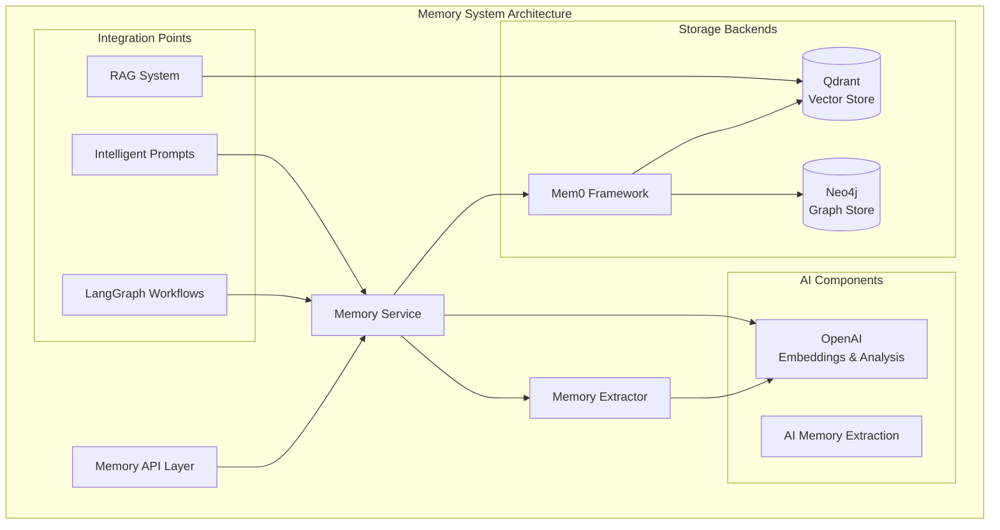
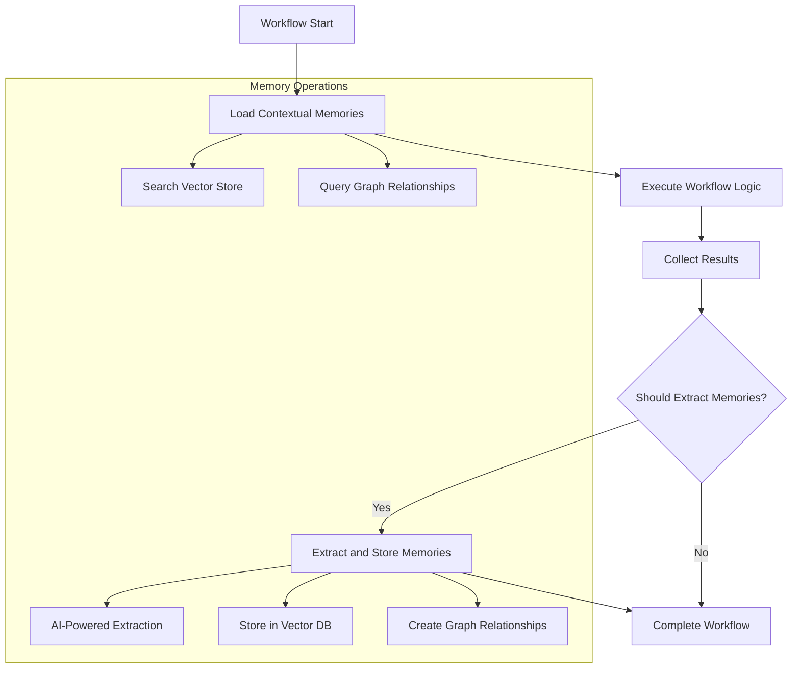

# 🧠 Memory System Documentation

Comprehensive guide to Paladin AI's intelligent memory and learning system.

## Overview

The Paladin AI memory system is a sophisticated, multi-layered architecture designed to provide intelligent context awareness and learning capabilities. It combines vector similarity search, graph relationships, and AI-powered extraction to enable the system to learn from past interactions and make informed decisions.

## Architecture Overview



## Core Components

### 1. Mem0AI Framework Integration

The system uses the Mem0 framework as the primary orchestration layer for memory operations.

#### Configuration
```bash
# Mem0 Framework Configuration
MEM0_PROVIDER=qdrant
MEM0_VECTOR_STORE=qdrant
MEM0_GRAPH_STORE=neo4j
MEM0_EMBEDDING_MODEL=text-embedding-3-small
MEM0_EMBEDDING_DIMENSION=1536
MEM0_MEMORY_DECAY_RATE=0.01
MEM0_MAX_MEMORY_ITEMS=10000
MEM0_SIMILARITY_THRESHOLD=0.7
MEM0_FALLBACK_MODE=true
```

#### Initialization
```python
from mem0 import Memory

# Initialize with hybrid storage
memory = Memory()

# Configuration for operations
config = {
    "collection_name": "paladinai_memory",
    "vector_size": 1536,
    "distance_metric": "Cosine",
    "embedding_model": "text-embedding-3-small",
    "similarity_threshold": 0.7,
    "max_memory_items": 10000
}
```

### 2. Vector Storage with Qdrant

#### Setup and Configuration
```bash
# Qdrant Configuration
QDRANT_HOST=http://localhost
QDRANT_PORT=6333
QDRANT_COLLECTION_NAME=paladinai_memory
QDRANT_VECTOR_SIZE=1536
QDRANT_DISTANCE_METRIC=Cosine
```

#### Collection Management
```python
# Automatic collection creation
await qdrant_client.create_collection(
    collection_name="paladinai_memory",
    vectors_config=VectorParams(
        size=1536,
        distance=Distance.COSINE
    )
)
```

#### Features
- **OpenAI Embeddings**: Uses `text-embedding-3-small` for vector generation
- **Similarity Search**: Advanced semantic search with scoring
- **Metadata Filtering**: Complex filtering by user, type, confidence
- **Fallback Search**: Keyword-based fallback when vector search fails

### 3. Graph Database with Neo4j

#### Configuration
```bash
# Neo4j Configuration
NEO4J_HOST=localhost
NEO4J_BOLT_PORT=7687
NEO4J_USERNAME=neo4j
NEO4J_PASSWORD=paladinai_neo4j_pass
```

#### Relationship Types
The system supports dynamic relationship types:
- `TRIGGERS`: One entity triggers another
- `REQUIRES`: Dependency relationships
- `MONITORS`: Monitoring relationships
- `INDICATES`: Symptom-condition relationships
- `DEPENDS_ON`: Functional dependencies
- `CORRELATES_WITH`: Behavioral correlations

#### Graph Operations
```python
# Store relationship in Neo4j
def to_cypher_create(self) -> str:
    return f"""
    MERGE (s:Entity {{name: '{self.source}'}})
    MERGE (t:Entity {{name: '{self.target}'}})
    MERGE (s)-[r:{self.relationship}]->(t)
    SET r.properties = {self.properties}
    """
```

## Memory Types and Models

### Core Data Models

```python
class MemoryEntry(BaseModel):
    content: str
    memory_type: str  # Dynamic type system
    user_id: Optional[str] = None
    session_id: Optional[str] = None
    workflow_type: Optional[str] = None
    confidence: float = 1.0
    metadata: Dict[str, Any] = {}
    created_at: datetime = datetime.now()

class GraphRelationship(BaseModel):
    source: str
    relationship: str
    target: str
    properties: Dict[str, Any] = {}
```

### Dynamic Memory Types

The system supports flexible memory types that are created dynamically:

#### Standard Types
- **`instruction`**: Explicit user instructions
- **`pattern`**: Learned operational patterns
- **`knowledge`**: Factual system knowledge
- **`operational`**: Operational procedures
- **`incident_resolution_step`**: Troubleshooting steps
- **`performance_baseline`**: System performance data
- **`error_pattern`**: Common error scenarios

#### Custom Types
Types are created dynamically based on content analysis:
```python
# AI-powered type discovery
async def suggest_memory_type(self, content: str) -> str:
    prompt = f"""
    Analyze this content and suggest the most appropriate memory type:
    Content: {content}
    
    Available types: instruction, pattern, knowledge, operational, 
                    incident_resolution_step, performance_baseline, error_pattern
    
    Or suggest a new type if none fit well.
    """
    
    response = await openai_client.chat.completions.create(
        model="gpt-4o-mini",
        messages=[{"role": "user", "content": prompt}]
    )
    
    return response.choices[0].message.content
```

## API Endpoints

### Memory Management Endpoints

#### 1. Store Instructions
```http
POST /api/memory/instruction
Content-Type: application/json

{
  "instruction": "Always check systemd logs for application errors",
  "user_id": "admin",
  "context": {"priority": "high", "domain": "troubleshooting"}
}
```

**Response:**
```json
{
  "success": true,
  "memory_id": "memory_123456",
  "relationships_count": 3,
  "memory_type": "instruction"
}
```

#### 2. Search Memories
```http
POST /api/memory/search
Content-Type: application/json

{
  "query": "CPU performance issues",
  "memory_types": ["pattern", "operational"],
  "user_id": "admin",
  "limit": 10,
  "confidence_threshold": 0.7
}
```

**Response:**
```json
{
  "success": true,
  "total_results": 5,
  "memories": [
    {
      "id": "memory_789",
      "content": "High CPU usage often correlates with memory leaks",
      "memory_type": "pattern",
      "confidence": 0.85,
      "metadata": {
        "created_at": "2024-01-01T12:00:00Z",
        "user_id": "admin"
      }
    }
  ]
}
```

#### 3. Contextual Memories
```http
GET /api/memory/contextual?context=high CPU usage&workflow_type=INCIDENT&limit=5
```

**Response:**
```json
{
  "success": true,
  "memories": [
    {
      "id": "memory_456",
      "content": "Check for runaway processes when CPU spikes occur",
      "memory_type": "operational",
      "relevance_score": 0.92
    }
  ],
  "context": "high CPU usage",
  "workflow_type": "INCIDENT"
}
```

#### 4. Extract Memories
```http
POST /api/memory/extract
Content-Type: application/json

{
  "content": "We discovered that the payment service failures were caused by database connection timeouts. The fix was to increase the connection pool size from 10 to 25.",
  "user_input": "Investigate payment service issues",
  "workflow_type": "INCIDENT",
  "session_id": "session_123"
}
```

#### 5. Memory Health Check
```http
GET /api/memory/health
```

**Response:**
```json
{
  "status": "healthy",
  "backends": {
    "mem0": "connected",
    "qdrant": "connected",
    "neo4j": "connected"
  },
  "search_test": true
}
```

## Memory Operations

### 1. Memory Extraction

The system automatically extracts valuable information from workflow interactions:

```python
async def extract_from_workflow_state(
    self,
    state: Dict[str, Any],
    user_input: str,
    workflow_type: str
) -> Dict[str, Any]:
    
    # Determine if extraction is necessary
    if not await self._should_extract_memories(state, user_input, workflow_type):
        return {"success": True, "memories_stored": 0}
    
    # Extract memories using AI
    extraction_request = MemoryExtractionRequest(
        content=self._format_workflow_content(state),
        user_input=user_input,
        workflow_type=workflow_type,
        session_id=state.get("session_id"),
        user_id=state.get("user_id"),
        context=self._extract_context(state)
    )
    
    result = await get_memory_service().extract_and_store_memories(extraction_request)
    return result
```

### 2. Memory Search

#### Vector Similarity Search
```python
async def search_memories(self, query: MemorySearchQuery) -> Dict[str, Any]:
    try:
        # Generate embedding for query
        embedding = await self._generate_embedding(query.query)
        
        # Search in Qdrant
        search_result = await self.qdrant_client.search(
            collection_name=self.collection_name,
            query_vector=embedding,
            limit=query.limit,
            score_threshold=query.confidence_threshold
        )
        
        # Format results
        memories = []
        for point in search_result:
            memory = {
                "id": str(point.id),
                "content": point.payload.get("content"),
                "memory_type": point.payload.get("memory_type"),
                "confidence": point.score,
                "metadata": point.payload.get("metadata", {})
            }
            memories.append(memory)
        
        return {
            "success": True,
            "total_results": len(memories),
            "memories": memories
        }
        
    except Exception as e:
        return {
            "success": False,
            "error": str(e),
            "memories": []
        }
```

#### Graph Relationship Search
```python
async def get_related_entities(self, entity: str) -> List[Dict[str, Any]]:
    query = """
    MATCH (n:Entity {name: $entity})-[r]-(m:Entity)
    RETURN m.name as related_entity, type(r) as relationship, r.properties as properties
    LIMIT 10
    """
    
    async with self.neo4j_driver.session() as session:
        result = await session.run(query, entity=entity)
        relationships = []
        
        async for record in result:
            relationships.append({
                "entity": record["related_entity"],
                "relationship": record["relationship"],
                "properties": record["properties"]
            })
        
        return relationships
```

### 3. Contextual Memory Retrieval

```python
async def get_contextual_memories(
    self, 
    context: str, 
    workflow_type: str, 
    limit: int = 5
) -> List[Dict[str, Any]]:
    
    # Create search query with context
    search_query = MemorySearchQuery(
        query=f"context: {context} workflow: {workflow_type}",
        memory_types=None,
        user_id=None,
        limit=limit * 2,  # Get more to filter
        confidence_threshold=0.5
    )
    
    # Search for relevant memories
    search_results = await self.search_memories(search_query)
    
    if not search_results["success"]:
        return []
    
    # Filter by workflow type relevance
    relevant_memories = []
    for memory in search_results["memories"]:
        memory_workflow = memory.get("metadata", {}).get("workflow_type")
        
        # Include if workflow type matches or is unspecified
        if memory_workflow == workflow_type or not memory_workflow:
            relevant_memories.append({
                **memory,
                "relevance_score": memory["confidence"]
            })
    
    # Sort by relevance and return top results
    relevant_memories.sort(key=lambda x: x["relevance_score"], reverse=True)
    return relevant_memories[:limit]
```

## Workflow Integration

### Memory-Enhanced Workflows



### Workflow Enhancement

```python
# Memory context loading before workflow execution
async def enhance_workflow_with_memory(
    self, 
    state: Dict[str, Any]
) -> Dict[str, Any]:
    
    user_input = state.get("user_input", "")
    workflow_type = state.get("workflow_type", "QUERY")
    
    # Get contextual memories
    memories = await get_memory_service().get_contextual_memories(
        context=user_input,
        workflow_type=workflow_type,
        limit=5
    )
    
    # Add memories to workflow state
    state["contextual_memories"] = memories
    state["memory_context"] = self._format_memory_context(memories)
    
    return state

# Memory extraction after workflow completion
async def extract_workflow_memories(
    self,
    state: Dict[str, Any]
) -> Dict[str, Any]:
    
    # Extract memories from completed workflow
    extraction_result = await self.memory_extractor.extract_from_workflow_state(
        state=state,
        user_input=state.get("user_input", ""),
        workflow_type=state.get("workflow_type", "QUERY")
    )
    
    state["memory_extraction_result"] = extraction_result
    return state
```

## Configuration and Setup

### Environment Configuration

```bash
# Core Memory Configuration
QDRANT_HOST=http://localhost
QDRANT_PORT=6333
QDRANT_COLLECTION_NAME=paladinai_memory
QDRANT_VECTOR_SIZE=1536
QDRANT_DISTANCE_METRIC=Cosine

# Neo4j Configuration
NEO4J_HOST=localhost
NEO4J_BOLT_PORT=7687
NEO4J_USERNAME=neo4j
NEO4J_PASSWORD=paladinai_neo4j_pass

# Mem0 Framework Configuration
MEM0_PROVIDER=qdrant
MEM0_VECTOR_STORE=qdrant
MEM0_GRAPH_STORE=neo4j
MEM0_EMBEDDING_MODEL=text-embedding-3-small
MEM0_SIMILARITY_THRESHOLD=0.7
MEM0_MAX_MEMORY_ITEMS=10000

# OpenAI Configuration
OPENAI_API_KEY=your_key_here
OPENAI_MODEL=gpt-4o-mini
```

### Infrastructure Setup

#### Docker Compose Configuration
```yaml
# infra/memory/docker-compose.yml
services:
  # Qdrant Vector Database
  qdrant:
    image: qdrant/qdrant:latest
    ports:
      - "6333:6333"
    volumes:
      - ./data/qdrant:/qdrant/storage
    environment:
      QDRANT__SERVICE__HTTP_PORT: 6333
      QDRANT__SERVICE__GRPC_PORT: 6334

  # Neo4j Graph Database  
  neo4j:
    image: neo4j:5.15-community
    ports:
      - "7474:7474"  # HTTP
      - "7687:7687"  # Bolt
    volumes:
      - ./data/neo4j:/data
    environment:
      NEO4J_AUTH: neo4j/paladinai_neo4j_pass
      NEO4J_PLUGINS: '["apoc"]'
      NEO4J_dbms_security_procedures_unrestricted: apoc.*
```

#### Initialization Scripts
```bash
#!/bin/bash
# scripts/setup-memory.sh

# Start memory infrastructure
docker-compose -f infra/memory/docker-compose.yml up -d

# Wait for services to be ready
echo "Waiting for Qdrant..."
until curl -f http://localhost:6333/health; do sleep 2; done

echo "Waiting for Neo4j..."
until curl -f http://localhost:7474; do sleep 2; done

# Initialize collections and schemas
python scripts/init-memory-collections.py

echo "Memory system setup complete!"
```

## Usage Examples

### 1. Storing Operational Instructions

```python
# CLI usage
paladin --memory-store "Always check systemd logs when investigating application errors"

# API usage
import requests

response = requests.post("http://localhost:8000/api/memory/instruction", json={
    "instruction": "Database queries should timeout after 30 seconds to prevent connection pool exhaustion",
    "user_id": "admin",
    "context": {
        "domain": "database",
        "priority": "high",
        "applies_to": ["mysql", "postgresql"]
    }
})
```

### 2. Searching for Relevant Knowledge

```python
# Search for CPU-related patterns
paladin --memory-search "CPU performance issues" --limit 5 --confidence 0.7

# Search specific memory types
paladin --memory-search "deployment procedures" --memory-type operational
```

### 3. Getting Contextual Memories

```python
# Get memories relevant to current situation
paladin --memory-context "high memory usage" --workflow-type ACTION

# In code
memories = await memory_service.get_contextual_memories(
    context="payment service failing",
    workflow_type="INCIDENT",
    limit=5
)
```

### 4. Automatic Memory Extraction

```python
# During workflow execution, memories are automatically extracted
# when significant learning opportunities are detected

# Example: After resolving an incident
workflow_state = {
    "user_input": "Investigate payment service failures",
    "prometheus_data": {...},
    "loki_logs": {...},
    "resolution": "Increased connection pool size from 10 to 25",
    "outcome": "success"
}

# Memory extraction happens automatically
extraction_result = await memory_extractor.extract_from_workflow_state(
    state=workflow_state,
    user_input="Investigate payment service failures",
    workflow_type="INCIDENT"
)
```

## Advanced Features

### 1. Dynamic Type Discovery

The system automatically discovers new memory and relationship types:

```python
async def suggest_memory_type(self, content: str) -> str:
    """AI-powered memory type suggestion"""
    prompt = f"""
    Analyze this operational content and suggest the most appropriate memory type:
    
    Content: {content}
    
    Standard types: instruction, pattern, knowledge, operational, 
                   incident_resolution_step, performance_baseline, error_pattern
    
    If none fit well, suggest a new descriptive type (2-3 words, lowercase, underscore-separated).
    Respond with just the type name.
    """
    
    response = await self.openai_client.chat.completions.create(
        model="gpt-4o-mini",
        messages=[{"role": "user", "content": prompt}],
        temperature=0.1
    )
    
    return response.choices[0].message.content.strip().lower()
```

### 2. Relationship Discovery

```python
async def extract_relationships(self, content: str) -> List[GraphRelationship]:
    """Extract entity relationships from content"""
    prompt = f"""
    Extract entity relationships from this operational content:
    
    Content: {content}
    
    Identify pairs of entities and their relationships. Format as:
    Entity1 -> Relationship -> Entity2
    
    Example relationships: TRIGGERS, REQUIRES, MONITORS, INDICATES, DEPENDS_ON, CORRELATES_WITH
    """
    
    response = await self.openai_client.chat.completions.create(
        model="gpt-4o-mini",
        messages=[{"role": "user", "content": prompt}],
        temperature=0.1
    )
    
    # Parse response and create GraphRelationship objects
    relationships = self._parse_relationships(response.choices[0].message.content)
    return relationships
```

### 3. Memory-Guided Decision Making

```python
async def get_decision_guidance(
    self, 
    situation: str, 
    options: List[str]
) -> Dict[str, Any]:
    """Provide decision guidance based on memory patterns"""
    
    # Search for relevant patterns
    memories = await self.search_memories(MemorySearchQuery(
        query=situation,
        memory_types=["pattern", "operational", "incident_resolution_step"],
        limit=10,
        confidence_threshold=0.6
    ))
    
    # Analyze patterns for each option
    guidance = {}
    for option in options:
        relevant_memories = [
            m for m in memories["memories"] 
            if option.lower() in m["content"].lower()
        ]
        
        success_rate = self._calculate_success_rate(relevant_memories)
        risk_factors = self._identify_risk_factors(relevant_memories)
        
        guidance[option] = {
            "success_rate": success_rate,
            "risk_factors": risk_factors,
            "supporting_memories": len(relevant_memories)
        }
    
    return guidance
```

## Performance and Optimization

### 1. Caching Strategy

```python
from functools import lru_cache
import asyncio

class MemoryCache:
    def __init__(self, ttl: int = 300):  # 5 minutes TTL
        self.cache = {}
        self.ttl = ttl
    
    @lru_cache(maxsize=1000)
    async def get_cached_search(self, query_hash: str):
        """Cache search results for frequently accessed queries"""
        if query_hash in self.cache:
            result, timestamp = self.cache[query_hash]
            if time.time() - timestamp < self.ttl:
                return result
        
        return None
    
    async def cache_search_result(self, query_hash: str, result: Dict[str, Any]):
        """Store search result in cache"""
        self.cache[query_hash] = (result, time.time())
```

### 2. Batch Operations

```python
async def batch_store_memories(self, memories: List[MemoryEntry]) -> Dict[str, Any]:
    """Efficiently store multiple memories"""
    
    # Prepare batch operations
    vector_operations = []
    graph_operations = []
    
    for memory in memories:
        # Generate embedding
        embedding = await self._generate_embedding(memory.content)
        
        # Prepare vector operation
        vector_operations.append({
            "id": memory.id,
            "vector": embedding,
            "payload": memory.dict()
        })
        
        # Extract relationships for graph operations
        relationships = await self._extract_relationships(memory.content)
        graph_operations.extend(relationships)
    
    # Execute batch operations
    vector_result = await self.qdrant_client.upsert_batch(
        collection_name=self.collection_name,
        points=vector_operations
    )
    
    graph_result = await self._batch_store_relationships(graph_operations)
    
    return {
        "success": True,
        "memories_stored": len(memories),
        "relationships_created": len(graph_operations)
    }
```

### 3. Connection Pooling

```python
# Optimized connection management
class OptimizedMemoryService:
    def __init__(self):
        # Qdrant client with connection pooling
        self.qdrant_client = QdrantClient(
            host=config.QDRANT_HOST,
            port=config.QDRANT_PORT,
            timeout=30,
            # Connection pool settings
            pool_size=20,
            pool_connections=10
        )
        
        # Neo4j driver with connection pooling
        self.neo4j_driver = GraphDatabase.driver(
            config.NEO4J_URI,
            auth=(config.NEO4J_USERNAME, config.NEO4J_PASSWORD),
            max_connection_lifetime=3600,
            max_connection_pool_size=50,
            connection_acquisition_timeout=60
        )
```

## Monitoring and Observability

### 1. Health Monitoring

```python
async def comprehensive_health_check() -> Dict[str, Any]:
    """Comprehensive health check for memory system"""
    
    health_status = {
        "status": "unknown",
        "backends": {},
        "performance": {},
        "errors": []
    }
    
    try:
        # Test Qdrant connectivity
        qdrant_start = time.time()
        qdrant_health = await self.qdrant_client.get_collection(self.collection_name)
        qdrant_time = time.time() - qdrant_start
        
        health_status["backends"]["qdrant"] = {
            "status": "connected",
            "response_time_ms": qdrant_time * 1000,
            "collection_exists": True
        }
        
        # Test Neo4j connectivity
        neo4j_start = time.time()
        async with self.neo4j_driver.session() as session:
            result = await session.run("RETURN 1 as test")
            await result.single()
        neo4j_time = time.time() - neo4j_start
        
        health_status["backends"]["neo4j"] = {
            "status": "connected",
            "response_time_ms": neo4j_time * 1000
        }
        
        # Test search functionality
        search_start = time.time()
        test_result = await self.search_memories(MemorySearchQuery(
            query="test connectivity",
            limit=1
        ))
        search_time = time.time() - search_start
        
        health_status["performance"]["search_time_ms"] = search_time * 1000
        health_status["performance"]["search_success"] = test_result["success"]
        
        # Overall status
        if all(backend["status"] == "connected" for backend in health_status["backends"].values()):
            health_status["status"] = "healthy"
        else:
            health_status["status"] = "degraded"
            
    except Exception as e:
        health_status["status"] = "unhealthy"
        health_status["errors"].append(str(e))
    
    return health_status
```

### 2. Performance Metrics

```python
import time
from typing import Dict, Any

class MemoryMetrics:
    def __init__(self):
        self.metrics = {
            "search_operations": 0,
            "store_operations": 0,
            "total_response_time": 0,
            "average_response_time": 0,
            "error_count": 0,
            "cache_hits": 0,
            "cache_misses": 0
        }
    
    def record_operation(self, operation: str, response_time: float, success: bool):
        """Record operation metrics"""
        self.metrics[f"{operation}_operations"] += 1
        self.metrics["total_response_time"] += response_time
        
        total_ops = sum(
            self.metrics[key] for key in self.metrics 
            if key.endswith("_operations")
        )
        self.metrics["average_response_time"] = (
            self.metrics["total_response_time"] / total_ops
        )
        
        if not success:
            self.metrics["error_count"] += 1
    
    def get_metrics(self) -> Dict[str, Any]:
        """Get current metrics"""
        return self.metrics.copy()
```

## Troubleshooting

### Common Issues and Solutions

#### 1. Connection Problems

```bash
# Test Qdrant connectivity
curl http://localhost:6333/health

# Test Neo4j connectivity
cypher-shell -a bolt://localhost:7687 -u neo4j -p paladinai_neo4j_pass "RETURN 1"

# Check memory service health
paladin --memory-health
```

#### 2. Search Performance Issues

```python
# Optimize search queries
search_query = MemorySearchQuery(
    query="specific search terms",  # Use specific terms
    memory_types=["pattern"],       # Filter by type
    limit=5,                       # Reasonable limit
    confidence_threshold=0.7       # Higher threshold
)

# Use caching for frequent searches
@lru_cache(maxsize=100)
async def cached_search(query: str):
    return await memory_service.search_memories(query)
```

#### 3. Memory Extraction Issues

```bash
# Check OpenAI API connectivity
curl -H "Authorization: Bearer $OPENAI_API_KEY" \
  https://api.openai.com/v1/models

# Verify extraction configuration
export OPENAI_MODEL=gpt-4o-mini
export MEM0_SIMILARITY_THRESHOLD=0.7
```

#### 4. Storage Issues

```bash
# Check Qdrant collection status
curl http://localhost:6333/collections/paladinai_memory

# Verify Neo4j database
cypher-shell -a bolt://localhost:7687 -u neo4j -p paladinai_neo4j_pass \
  "MATCH (n) RETURN count(n) as node_count"
```

### Debug Mode

```bash
# Enable debug logging
export LOG_LEVEL=debug

# Test with verbose output
paladin --debug --memory-search "test query"
```

## Best Practices

### 1. Memory Management

- **Specific Instructions**: Store specific, actionable instructions
- **Context Information**: Include relevant context with memories
- **Regular Cleanup**: Implement memory cleanup for outdated information
- **Type Classification**: Use appropriate memory types for better organization

### 2. Search Optimization

- **Targeted Queries**: Use specific search terms
- **Type Filtering**: Filter by memory type when possible
- **Confidence Thresholds**: Set appropriate confidence levels
- **Result Limits**: Use reasonable result limits

### 3. Performance

- **Batch Operations**: Use batch operations for multiple memories
- **Connection Pooling**: Optimize database connections
- **Caching**: Implement caching for frequent searches
- **Monitoring**: Monitor performance metrics regularly

### 4. Security

- **Access Control**: Implement user-based memory isolation
- **Data Sanitization**: Sanitize sensitive information
- **Encryption**: Use encryption for sensitive memories
- **Audit Logging**: Log memory operations for audit trails

---

The Paladin AI memory system provides sophisticated context awareness and learning capabilities, enabling the platform to continuously improve its responses and decision-making based on historical interactions and patterns.