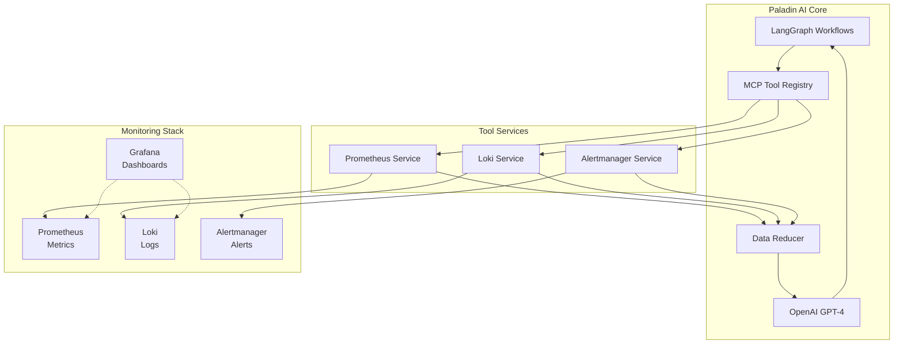
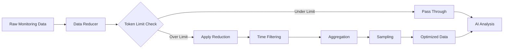
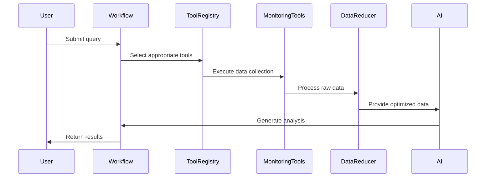

# 📊 Monitoring Integration Guide

Complete guide to integrating and configuring monitoring systems with Paladin AI.

## Overview

Paladin AI provides comprehensive integration with modern monitoring and observability tools through a sophisticated Model Context Protocol (MCP) architecture. The platform intelligently collects, analyzes, and responds to monitoring data from Prometheus, Loki, Grafana, and Alertmanager using AI-powered workflows.

## Architecture Overview



## Quick Setup

### 1. Infrastructure Deployment

```bash
# Start monitoring stack
make infra-up

# This deploys:
# - Prometheus (port 9090)
# - Loki (port 3100)
# - Grafana (port 3000)
# - Alertmanager (port 9093)
```

### 2. Environment Configuration

```bash
# Configure monitoring endpoints
export PROMETHEUS_URL=http://localhost:9090
export LOKI_URL=http://localhost:3100
export ALERTMANAGER_URL=http://localhost:9093

# Optional: Authentication tokens
export PROMETHEUS_AUTH_TOKEN=your-token
export LOKI_AUTH_TOKEN=your-token
export ALERTMANAGER_AUTH_TOKEN=your-token
```

### 3. Verify Integration

```bash
# Test monitoring tools
paladin --chat "Check monitoring system health"

# Verify specific tools
paladin --chat "Test Prometheus connection"
paladin --chat "Check Loki status"
paladin --chat "Verify Alertmanager connectivity"
```

## Prometheus Integration

### Features

- **PromQL Query Execution**: Instant and range queries
- **Metric Discovery**: Automatic metric metadata collection
- **Target Monitoring**: Scrape target health validation
- **Label Management**: Dynamic label discovery and filtering
- **Time Series Analysis**: Statistical aggregation and trend analysis

### Configuration

#### Environment Variables
```bash
# Prometheus Configuration
PROMETHEUS_URL=http://localhost:9090
PROMETHEUS_TIMEOUT=30  # seconds
PROMETHEUS_AUTH_TOKEN=  # optional Bearer token
```

#### Connection Testing
```bash
# Test Prometheus connectivity
curl http://localhost:9090/-/healthy

# Query API test
curl http://localhost:9090/api/v1/query?query=up
```

### Usage Examples

#### Basic Metrics Queries
```bash
# Check system uptime
paladin --chat "Show me system uptime metrics"

# CPU usage analysis
paladin --chat "What's the current CPU usage across all servers?"

# Memory consumption
paladin --chat "Check memory usage for the last hour"
```

#### Advanced Analysis
```bash
# Performance comparison
paladin --chat "Compare current CPU usage to last week"

# Capacity planning
paladin --chat "Predict when we'll need more disk space"

# Anomaly detection
paladin --chat "Find unusual patterns in response time metrics"
```

### PromQL Examples

The AI automatically generates PromQL queries, but you can also use specific queries:

```promql
# CPU usage by instance
rate(cpu_usage_seconds_total[5m])

# Memory utilization percentage
(1 - memory_available_bytes / memory_total_bytes) * 100

# HTTP request rate
rate(http_requests_total[1m])

# Error rate percentage
rate(http_requests_total{status=~"5.."}[5m]) / rate(http_requests_total[5m]) * 100
```

### Data Models

#### Query Request
```json
{
  "query": "up",
  "time": "2024-01-01T12:00:00Z",
  "timeout": "30s"
}
```

#### Range Query Request
```json
{
  "query": "rate(cpu_usage[5m])",
  "start": "2024-01-01T10:00:00Z",
  "end": "2024-01-01T12:00:00Z",
  "step": "30s"
}
```

## Loki Integration

### Features

- **LogQL Query Engine**: Instant and range log queries
- **Label Discovery**: Dynamic label and value discovery
- **Stream Processing**: Real-time log tail functionality
- **Pattern Extraction**: Automatic log pattern recognition
- **Metrics Generation**: LogQL metrics aggregation

### Configuration

#### Environment Variables
```bash
# Loki Configuration
LOKI_URL=http://localhost:3100
LOKI_TIMEOUT=30  # seconds
LOKI_AUTH_TOKEN=  # optional Bearer token
```

#### Health Check
```bash
# Test Loki connectivity
curl http://localhost:3100/ready

# Check ingester status
curl http://localhost:3100/metrics
```

### Usage Examples

#### Log Analysis
```bash
# Error investigation
paladin --chat "Show me error logs from the last hour"

# Application debugging
paladin --chat "Find logs related to payment service failures"

# Performance analysis
paladin --chat "Analyze slow query logs"
```

#### Pattern Recognition
```bash
# Identify common errors
paladin --chat "What are the most common error patterns?"

# Traffic analysis
paladin --chat "Analyze access log patterns"

# Security monitoring
paladin --chat "Look for suspicious login attempts"
```

### LogQL Examples

```logql
# Error logs from last hour
{job="webapp"} |= "error" | json | level="error"

# HTTP 5xx responses
{job="nginx"} | json | status_code >= 500

# Slow queries
{service="database"} | regexp "duration: (?P<duration>\\d+)ms" | duration > 1000

# Rate of errors per minute
rate({job="webapp"} |= "error" [1m])
```

### Data Models

#### Query Request
```json
{
  "query": "{job=\"webapp\"} |= \"error\"",
  "limit": 100,
  "time": "2024-01-01T12:00:00Z",
  "direction": "backward"
}
```

#### Range Query Request
```json
{
  "query": "rate({job=\"webapp\"}[1m])",
  "start": "2024-01-01T10:00:00Z",
  "end": "2024-01-01T12:00:00Z",
  "step": "30s"
}
```

## Alertmanager Integration

### Features

- **Alert Management**: Active alert retrieval and filtering
- **Silence Management**: Create, modify, and delete silences
- **Route Configuration**: Alert routing and grouping rules
- **Receiver Management**: Notification channel configuration
- **Inhibition Rules**: Alert suppression logic

### Configuration

#### Environment Variables
```bash
# Alertmanager Configuration
ALERTMANAGER_URL=http://localhost:9093
ALERTMANAGER_TIMEOUT=30  # seconds
ALERTMANAGER_AUTH_TOKEN=  # optional Bearer token
```

#### Health Check
```bash
# Test Alertmanager connectivity
curl http://localhost:9093/-/healthy

# Check configuration
curl http://localhost:9093/api/v1/status
```

### Usage Examples

#### Alert Analysis
```bash
# Current alerts
paladin --chat "What alerts are currently firing?"

# Critical alerts
paladin --chat "Show me all critical alerts"

# Alert trends
paladin --chat "How many alerts fired in the last 24 hours?"
```

#### Silence Management
```bash
# Create silence
paladin --chat "Silence alerts for maintenance window"

# Review silences
paladin --chat "Show me active silences"

# Remove silence
paladin --chat "Remove silence for service=api"
```

### Alert Routing Example

```yaml
# alertmanager.yml
route:
  group_by: ['alertname', 'cluster', 'service']
  group_wait: 10s
  group_interval: 10s
  repeat_interval: 1h
  receiver: 'web.hook'
  routes:
  - match:
      severity: critical
    receiver: 'critical-alerts'
    continue: true
  - match:
      severity: warning
    receiver: 'warning-alerts'

receivers:
- name: 'web.hook'
  webhook_configs:
  - url: 'http://paladin:8000/api/v1/alert-analysis-mode'
    send_resolved: true
```

## Grafana Integration

### Dashboard Configuration

While direct API integration isn't implemented, Grafana integrates through:

#### Automated Setup
```bash
# Deploy with preconfigured dashboards
docker-compose up grafana

# Access at http://localhost:3000
# Default credentials: admin/admin
```

#### Datasource Configuration
```yaml
# datasources.yml
apiVersion: 1
datasources:
  - name: Prometheus
    type: prometheus
    url: http://prometheus:9090
    access: proxy
    isDefault: true
    
  - name: Loki
    type: loki
    url: http://loki:3100
    access: proxy
```

#### Dashboard Provisioning
```yaml
# dashboards.yml
apiVersion: 1
providers:
  - name: 'paladin-dashboards'
    folder: ''
    type: file
    options:
      path: /etc/grafana/provisioning/dashboards
```

### AI-Enhanced Dashboards

```bash
# Generate dashboard recommendations
paladin --chat "Suggest dashboards for microservices monitoring"

# Create custom visualizations
paladin --chat "Design a dashboard for payment service health"

# Performance dashboard analysis
paladin --chat "Analyze the current system dashboard"
```

## Data Reduction and Optimization

### Intelligent Data Management



### Reduction Strategies

#### 1. Time-Based Filtering
```python
# Prioritize recent data (last 2 hours)
recent_data = data_reducer.filter_by_time(
    data, 
    time_window="2h",
    priority="recent"
)
```

#### 2. Severity-Based Prioritization
```python
# Prioritize critical alerts
critical_alerts = data_reducer.prioritize_by_severity(
    alerts,
    severity_order=["critical", "warning", "info"]
)
```

#### 3. Statistical Aggregation
```python
# Aggregate metric data points
aggregated_metrics = data_reducer.aggregate_metrics(
    metrics,
    aggregation=["min", "max", "avg", "count"]
)
```

#### 4. Pattern Recognition
```python
# Group similar log entries
grouped_logs = data_reducer.group_similar_logs(
    logs,
    similarity_threshold=0.8
)
```

### Configuration

```python
# Data reduction configuration
data_reducer = DataReducer(
    max_tokens=100000,      # Token limit for LLM
    time_window="2h",       # Default time window
    max_log_lines=1000,     # Maximum log lines
    aggregation_threshold=0.9  # Aggregation trigger
)
```

## Workflow Integration

### LangGraph Workflow Types

#### 1. Query Workflows
- Simple status checks
- Metric retrievals
- Quick analysis queries

```bash
# Example query workflow
paladin --chat "What's the current system status?"
```

#### 2. Incident Workflows
- Complex problem investigation
- Root cause analysis
- Multi-source data correlation

```bash
# Example incident workflow
paladin --chat "Investigate why users are reporting slow response times"
```

#### 3. Action Workflows
- System modifications
- Alert management
- Configuration changes

```bash
# Example action workflow
paladin --chat "Create a silence for the API service during maintenance"
```

### Workflow Execution Flow



## Advanced Configuration

### 1. Authentication Setup

#### Prometheus with Authentication
```bash
# Basic Auth
export PROMETHEUS_AUTH_TOKEN="Basic $(echo -n 'user:pass' | base64)"

# Bearer Token
export PROMETHEUS_AUTH_TOKEN="Bearer your-jwt-token"
```

#### Loki with Authentication
```bash
# API Key
export LOKI_AUTH_TOKEN="Bearer your-api-key"

# Basic Auth
export LOKI_AUTH_TOKEN="Basic $(echo -n 'user:pass' | base64)"
```

### 2. SSL/TLS Configuration

```bash
# HTTPS endpoints
export PROMETHEUS_URL=https://prometheus.example.com
export LOKI_URL=https://loki.example.com
export ALERTMANAGER_URL=https://alertmanager.example.com

# Certificate validation
export SSL_VERIFY=true
export SSL_CERT_PATH=/path/to/cert.pem
```

### 3. Custom Headers

```python
# Custom headers configuration
custom_headers = {
    "X-Scope-OrgID": "tenant-1",
    "X-Custom-Header": "value"
}
```

### 4. Timeout Configuration

```bash
# Service-specific timeouts
export PROMETHEUS_TIMEOUT=60
export LOKI_TIMEOUT=120
export ALERTMANAGER_TIMEOUT=30

# Global request timeout
export REQUEST_TIMEOUT=300
```

## Troubleshooting

### Common Issues

#### 1. Connection Problems

```bash
# Test connectivity
paladin --chat "Test monitoring connectivity"

# Check specific services
curl -f $PROMETHEUS_URL/-/healthy
curl -f $LOKI_URL/ready
curl -f $ALERTMANAGER_URL/-/healthy
```

#### 2. Authentication Errors

```bash
# Verify tokens
curl -H "Authorization: $PROMETHEUS_AUTH_TOKEN" $PROMETHEUS_URL/api/v1/query?query=up

# Check token format
echo $PROMETHEUS_AUTH_TOKEN | base64 -d
```

#### 3. Query Timeout Issues

```bash
# Increase timeouts
export PROMETHEUS_TIMEOUT=120
export LOKI_TIMEOUT=180

# Use simpler queries
paladin --chat "Show simple system metrics"
```

#### 4. Data Reduction Problems

```bash
# Check data volume
paladin --chat "How much data are we processing?"

# Adjust reduction settings
export MAX_TOKENS=50000
export TIME_WINDOW=1h
```

### Debug Mode

```bash
# Enable debug logging
export LOG_LEVEL=debug

# Test specific tools
paladin --debug --chat "Test Prometheus with debug info"
```

### Health Monitoring

```bash
# Monitor integration health
paladin --chat "Check monitoring integration health"

# Service status
curl $PROMETHEUS_URL/api/v1/targets
curl $LOKI_URL/metrics
curl $ALERTMANAGER_URL/api/v1/status
```

## Performance Optimization

### 1. Query Optimization

- Use specific time ranges
- Limit result sets appropriately
- Optimize PromQL/LogQL queries
- Use appropriate aggregation functions

### 2. Connection Pooling

```python
# Optimized connection settings
aiohttp_session = aiohttp.ClientSession(
    timeout=aiohttp.ClientTimeout(total=30),
    connector=aiohttp.TCPConnector(
        limit=100,
        limit_per_host=30
    )
)
```

### 3. Caching Strategy

```python
# Implement response caching
@cached(ttl=60)  # Cache for 60 seconds
async def get_metrics(query: str):
    return await prometheus_service.query(query)
```

### 4. Batch Processing

```python
# Batch multiple queries
async def batch_queries(queries: list):
    tasks = [prometheus_service.query(q) for q in queries]
    return await asyncio.gather(*tasks)
```

## Monitoring Best Practices

### 1. Query Design

- **Specific over general**: Use targeted queries instead of broad scans
- **Time boundaries**: Always specify appropriate time ranges
- **Label filtering**: Use label selectors to reduce data volume
- **Aggregation**: Use rate(), avg(), sum() appropriately

### 2. Alert Configuration

- **Meaningful thresholds**: Set alerts based on business impact
- **Proper grouping**: Group related alerts to reduce noise
- **Runbook integration**: Include remediation steps in alerts
- **Escalation policies**: Define clear escalation paths

### 3. Dashboard Organization

- **Service-oriented**: Organize dashboards by service/component
- **User-focused**: Create dashboards for different user types
- **Performance metrics**: Include SLI/SLO tracking
- **Business metrics**: Monitor business-relevant KPIs

### 4. Log Management

- **Structured logging**: Use JSON or structured log formats
- **Appropriate levels**: Use log levels correctly
- **Context preservation**: Include correlation IDs
- **Retention policies**: Set appropriate log retention

## Integration Examples

### 1. Custom Alerting Workflow

```python
# Custom alert processing
async def process_custom_alert(alert_data):
    # Collect context from monitoring systems
    metrics = await prometheus_service.query_range(
        "rate(http_requests_total[5m])",
        start="now-1h",
        end="now"
    )
    
    logs = await loki_service.query_range(
        '{service="api"} |= "error"',
        start="now-1h", 
        end="now"
    )
    
    # Analyze with AI
    analysis = await ai_analyze({
        "alert": alert_data,
        "metrics": metrics,
        "logs": logs
    })
    
    return analysis
```

### 2. Automated Incident Response

```python
# Incident response automation
async def handle_incident(incident_data):
    # Gather comprehensive data
    context = await gather_incident_context(incident_data)
    
    # AI-powered analysis
    root_cause = await analyze_root_cause(context)
    
    # Generate remediation steps
    remediation = await generate_remediation(root_cause)
    
    # Create silence if needed
    if remediation.requires_silence:
        await create_maintenance_silence(
            duration=remediation.estimated_duration
        )
    
    return {
        "analysis": root_cause,
        "remediation": remediation,
        "status": "automated_response_initiated"
    }
```

### 3. Performance Monitoring

```python
# Continuous performance monitoring
async def monitor_performance():
    while True:
        # Collect key metrics
        metrics = await collect_performance_metrics()
        
        # Detect anomalies
        anomalies = await detect_anomalies(metrics)
        
        if anomalies:
            # Generate proactive alerts
            await create_proactive_alert(anomalies)
        
        await asyncio.sleep(60)  # Check every minute
```

## Security Considerations

### 1. Access Control

- Use service accounts with minimal permissions
- Implement token rotation policies
- Secure token storage (environment variables, secrets management)
- Network-level access restrictions

### 2. Data Protection

- Encrypt data in transit (HTTPS/TLS)
- Implement proper authentication
- Log access for audit trails
- Sanitize sensitive data in logs

### 3. Rate Limiting

- Implement query rate limiting
- Monitor API usage patterns
- Set appropriate timeouts
- Use circuit breakers for resilience

---

This monitoring integration guide provides comprehensive coverage of integrating Paladin AI with modern observability tools. The AI-powered approach enables intelligent data collection, analysis, and response, making monitoring operations more efficient and effective.