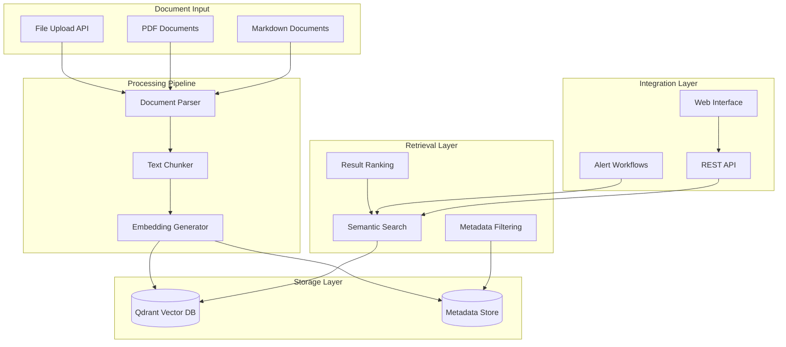

# 📄 RAG System Documentation

Comprehensive guide to Paladin AI's Retrieval-Augmented Generation (RAG) system for intelligent document processing and knowledge retrieval.

## Overview

The Paladin AI RAG system is a sophisticated document processing and knowledge retrieval pipeline designed to enhance alert analysis and incident response with contextual documentation. The system ingests, processes, and makes searchable various document formats to provide relevant information during monitoring and troubleshooting workflows.

## Architecture Overview



## Core Components

### 1. Document Processing Pipeline

#### Document Parser

The document parser handles multiple file formats with format-specific processing:

```python
class DocumentParser:
    async def parse_document(self, file_content: bytes, file_type: DocumentType) -> str:
        """Parse document content based on file type"""
        if file_type == DocumentType.PDF:
            return await self._parse_pdf(file_content)
        elif file_type == DocumentType.MARKDOWN:
            return await self._parse_markdown(file_content)
        else:
            raise ValueError(f"Unsupported document type: {file_type}")
```

**PDF Processing Features:**
- **PyMuPDF Integration**: Uses fitz library for robust PDF extraction
- **Page Preservation**: Maintains page numbers for accurate referencing
- **Multi-page Support**: Handles large documents with page markers
- **Error Recovery**: Graceful handling of corrupted or encrypted PDFs

```python
async def _parse_pdf(self, file_content: bytes) -> str:
    """Extract text from PDF with page markers"""
    doc = fitz.open(stream=file_content, filetype="pdf")
    
    text_content = []
    for page_num in range(len(doc)):
        page = doc.load_page(page_num)
        page_text = page.get_text()
        
        if page_text.strip():
            text_content.append(f"=== Page {page_num + 1} ===\n{page_text}")
    
    doc.close()
    return "\n\n".join(text_content)
```

**Markdown Processing Features:**
- **Markdown to HTML**: Converts markdown to structured HTML
- **BeautifulSoup Parsing**: Extracts clean text while preserving structure
- **Code Block Preservation**: Maintains formatting for code examples
- **Metadata Extraction**: Extracts headers and structure information

```python
async def _parse_markdown(self, file_content: bytes) -> str:
    """Parse markdown content with structure preservation"""
    content = file_content.decode('utf-8')
    
    # Convert markdown to HTML
    html = markdown.markdown(content, extensions=['extra', 'codehilite'])
    
    # Parse HTML and extract clean text
    soup = BeautifulSoup(html, 'html.parser')
    
    # Preserve structure while extracting text
    text_parts = []
    for element in soup.find_all(['h1', 'h2', 'h3', 'h4', 'h5', 'h6', 'p', 'pre', 'code', 'li']):
        if element.name.startswith('h'):
            text_parts.append(f"\n# {element.get_text()}\n")
        elif element.name == 'pre':
            text_parts.append(f"\n```\n{element.get_text()}\n```\n")
        else:
            text_parts.append(element.get_text())
    
    return self._clean_text(" ".join(text_parts))
```

#### Text Chunker

The chunker implements intelligent text segmentation for optimal retrieval:

```python
class DocumentChunker:
    def __init__(self):
        self.chunk_size = 500  # tokens
        self.chunk_overlap = 50  # tokens
        self.encoding = tiktoken.get_encoding("cl100k_base")
        
        # Initialize text splitter with semantic separators
        self.text_splitter = RecursiveCharacterTextSplitter(
            chunk_size=2000,  # characters (approximate)
            chunk_overlap=200,
            length_function=len,
            separators=["\n\n", "\n", ". ", " ", ""]
        )
```

**Chunking Strategy:**
- **Token-based Sizing**: Uses tiktoken for accurate token counting
- **Semantic Separators**: Prioritizes natural breakpoints (paragraphs, sentences)
- **Overlap Management**: Maintains context continuity between chunks
- **PDF Page Awareness**: Preserves page boundaries for accurate references

```python
async def chunk_document(
    self, 
    text: str, 
    metadata: ChunkMetadata
) -> List[DocumentChunk]:
    """Split document into semantically meaningful chunks"""
    
    # Split text using recursive character splitter
    raw_chunks = self.text_splitter.split_text(text)
    
    chunks = []
    for i, chunk_text in enumerate(raw_chunks):
        # Count tokens for the chunk
        tokens = len(self.encoding.encode(chunk_text))
        
        # Create chunk with metadata
        chunk = DocumentChunk(
            text=chunk_text,
            metadata=ChunkMetadata(
                source=metadata.source,
                chunk_index=i,
                total_chunks=len(raw_chunks),
                token_count=tokens,
                document_type=metadata.document_type,
                page_number=self._extract_page_number(chunk_text)
            )
        )
        
        chunks.append(chunk)
    
    return chunks
```

#### Embedding Generator

Generates vector embeddings using OpenAI's models:

```python
async def generate_embeddings(self, chunks: List[DocumentChunk]) -> List[DocumentChunk]:
    """Generate embeddings for document chunks"""
    
    # Process in batches for efficiency
    batch_size = 20
    for i in range(0, len(chunks), batch_size):
        batch = chunks[i:i + batch_size]
        texts = [chunk.text for chunk in batch]
        
        try:
            # Generate embeddings using OpenAI
            response = await self.openai_client.embeddings.create(
                model="text-embedding-ada-002",
                input=texts
            )
            
            # Assign embeddings to chunks
            for j, chunk in enumerate(batch):
                chunk.embedding = response.data[j].embedding
                
        except Exception as e:
            logger.error(f"Embedding generation failed for batch {i}: {e}")
            # Handle embedding failures gracefully
            for chunk in batch:
                chunk.embedding = None
    
    return chunks
```

### 2. Vector Storage with Qdrant

#### Qdrant Integration

```python
class QdrantService:
    def __init__(self):
        self.client = QdrantClient(
            host=config.QDRANT_HOST,
            port=config.QDRANT_PORT,
            timeout=60
        )
        self.collection_name = "paladin_documentation"
        self.vector_size = 1536  # OpenAI ada-002 embedding dimension
```

**Collection Configuration:**
```python
async def ensure_collection_exists(self):
    """Create collection if it doesn't exist"""
    try:
        collection_info = await self.client.get_collection(self.collection_name)
        logger.info(f"Collection {self.collection_name} already exists")
    except Exception:
        # Create collection with cosine distance
        await self.client.create_collection(
            collection_name=self.collection_name,
            vectors_config=VectorParams(
                size=self.vector_size,
                distance=Distance.COSINE
            )
        )
        logger.info(f"Created collection {self.collection_name}")
```

**Document Storage:**
```python
async def store_chunks(self, chunks: List[DocumentChunk]) -> Dict[str, Any]:
    """Store document chunks in Qdrant"""
    
    points = []
    for chunk in chunks:
        if chunk.embedding is None:
            continue  # Skip chunks without embeddings
            
        point = PointStruct(
            id=str(uuid.uuid4()),
            vector=chunk.embedding,
            payload={
                "text": chunk.text,
                "source": chunk.metadata.source,
                "document_type": chunk.metadata.document_type.value,
                "chunk_index": chunk.metadata.chunk_index,
                "page_number": chunk.metadata.page_number,
                "token_count": chunk.metadata.token_count,
                "created_at": datetime.now().isoformat()
            }
        )
        points.append(point)
    
    # Batch upsert to Qdrant
    operation_info = await self.client.upsert(
        collection_name=self.collection_name,
        wait=True,
        points=points
    )
    
    return {
        "chunks_stored": len(points),
        "operation_info": operation_info
    }
```

### 3. Search and Retrieval

#### Semantic Search

```python
async def search_documents(
    self,
    query: str,
    limit: int = 5,
    score_threshold: float = 0.7,
    source_filter: Optional[str] = None,
    document_type_filter: Optional[str] = None
) -> Dict[str, Any]:
    """Perform semantic search on stored documents"""
    
    # Generate query embedding
    query_embedding = await self._generate_query_embedding(query)
    
    # Build search filter
    search_filter = Filter(
        must=self._build_search_filters(source_filter, document_type_filter)
    )
    
    # Execute search
    search_result = await self.client.search(
        collection_name=self.collection_name,
        query_vector=query_embedding,
        query_filter=search_filter,
        limit=limit,
        score_threshold=score_threshold,
        with_payload=True,
        with_vectors=False
    )
    
    # Format results
    results = []
    for scored_point in search_result:
        result = {
            "content": scored_point.payload["text"],
            "score": scored_point.score,
            "metadata": {
                "source": scored_point.payload["source"],
                "document_type": scored_point.payload["document_type"],
                "page_number": scored_point.payload.get("page_number"),
                "chunk_index": scored_point.payload["chunk_index"]
            }
        }
        results.append(result)
    
    return {
        "query": query,
        "results": results,
        "count": len(results)
    }
```

#### Advanced Filtering

```python
def _build_search_filters(
    self,
    source_filter: Optional[str],
    document_type_filter: Optional[str]
) -> List[FieldCondition]:
    """Build search filters based on criteria"""
    
    conditions = []
    
    if source_filter:
        conditions.append(
            FieldCondition(
                key="source",
                match=MatchValue(value=source_filter)
            )
        )
    
    if document_type_filter:
        conditions.append(
            FieldCondition(
                key="document_type",
                match=MatchValue(value=document_type_filter)
            )
        )
    
    return conditions
```

## API Endpoints

### Document Upload

```http
POST /api/v1/documents/upload
Content-Type: multipart/form-data

file: [PDF or Markdown file, max 50MB]
```

**Response:**
```json
{
  "document_id": "doc_123456",
  "status": "completed",
  "message": "Document processed successfully",
  "chunks_created": 15,
  "collection_name": "paladin_documentation"
}
```

**Implementation:**
```python
@documents_router.post("/upload")
async def upload_document(file: UploadFile = File(...)):
    """Upload and process document for RAG"""
    
    # Validate file type
    if not file.filename.lower().endswith(('.pdf', '.md', '.markdown')):
        raise HTTPException(
            status_code=400,
            detail="Only PDF and Markdown files are supported"
        )
    
    # Validate file size (50MB limit)
    file_content = await file.read()
    if len(file_content) > 50 * 1024 * 1024:
        raise HTTPException(
            status_code=413,
            detail="File size exceeds 50MB limit"
        )
    
    # Process document
    try:
        result = await rag_service.process_document(
            file_content=file_content,
            filename=file.filename,
            document_type=DocumentType.PDF if file.filename.lower().endswith('.pdf') else DocumentType.MARKDOWN
        )
        
        return DocumentProcessingResponse(
            document_id=result["document_id"],
            status=ProcessingStatus.COMPLETED,
            message="Document processed successfully",
            chunks_created=result["chunks_created"],
            collection_name=result["collection_name"]
        )
        
    except Exception as e:
        logger.error(f"Document processing failed: {e}")
        return DocumentProcessingResponse(
            document_id="",
            status=ProcessingStatus.FAILED,
            message=f"Processing failed: {str(e)}"
        )
```

### Document Search

```http
POST /api/v1/documents/search?query=kubernetes troubleshooting&limit=10&source_filter=runbook
```

**Response:**
```json
{
  "query": "kubernetes troubleshooting",
  "results": [
    {
      "content": "When troubleshooting Kubernetes pods, first check the pod status and logs...",
      "score": 0.85,
      "metadata": {
        "source": "k8s-troubleshooting.pdf",
        "document_type": "pdf",
        "page_number": 5,
        "chunk_index": 2
      }
    }
  ],
  "count": 1
}
```

### Health Check

```http
GET /api/v1/documents/health
```

**Response:**
```json
{
  "status": "healthy",
  "qdrant_connected": true,
  "collection": "paladin_documentation",
  "collections_count": 1
}
```

## Workflow Integration

### Alert Analysis Integration

The RAG system is integrated into alert analysis workflows to provide contextual documentation:

```python
async def rag_search_node(state: AlertWorkflowState) -> AlertWorkflowState:
    """RAG search node for alert analysis workflow"""
    
    # Extract alert context
    alert_context = state.get("alert_context", {})
    investigation_focus = state.get("investigation_focus", "")
    
    # Generate search queries based on alert context
    search_queries = await generate_contextual_search_queries(
        alert_context, 
        investigation_focus
    )
    
    # Execute searches
    rag_results = []
    for query in search_queries:
        try:
            search_result = await rag_service.search_documents(
                query=query["query"],
                limit=query.get("limit", 5),
                score_threshold=query.get("threshold", 0.7),
                source_filter=query.get("source_filter"),
                document_type_filter=query.get("document_type_filter")
            )
            
            if search_result["results"]:
                rag_results.extend(search_result["results"])
                
        except Exception as e:
            logger.error(f"RAG search failed for query '{query['query']}': {e}")
    
    # Add results to workflow state
    state["rag_search_results"] = rag_results
    state["rag_search_performed"] = True
    
    return state
```

### Contextual Query Generation

```python
async def generate_contextual_search_queries(
    alert_context: Dict[str, Any],
    investigation_focus: str
) -> List[Dict[str, Any]]:
    """Generate targeted search queries based on alert context"""
    
    queries = []
    
    # Extract key information from alert
    service_name = alert_context.get("service", "")
    alert_name = alert_context.get("alertname", "")
    severity = alert_context.get("severity", "")
    
    # Base query with alert information
    base_query = f"{alert_name} {service_name} {investigation_focus}"
    queries.append({
        "query": base_query,
        "intent": "primary",
        "limit": 5,
        "threshold": 0.7
    })
    
    # Runbook specific search
    if service_name:
        queries.append({
            "query": f"{service_name} runbook troubleshooting",
            "intent": "runbook",
            "source_filter": "runbook",
            "limit": 3,
            "threshold": 0.6
        })
    
    # Architecture documentation search
    queries.append({
        "query": f"{service_name} architecture documentation",
        "intent": "architecture",
        "document_type_filter": "pdf",
        "limit": 2,
        "threshold": 0.6
    })
    
    return queries
```

## Configuration

### Environment Variables

```bash
# Qdrant Configuration
QDRANT_HOST=http://localhost
QDRANT_PORT=6333
QDRANT_COLLECTION_NAME=paladin_documentation
QDRANT_VECTOR_SIZE=1536
QDRANT_DISTANCE_METRIC=Cosine

# OpenAI Configuration
OPENAI_API_KEY=your-openai-api-key
OPENAI_EMBEDDING_MODEL=text-embedding-ada-002

# Document Processing
MAX_FILE_SIZE_MB=50
CHUNK_SIZE_TOKENS=500
CHUNK_OVERLAP_TOKENS=50
DEFAULT_SCORE_THRESHOLD=0.7
```

### Infrastructure Setup

#### Docker Compose Configuration

```yaml
# infra/qdrant/docker-compose.yml
version: '3.8'
services:
  qdrant:
    image: qdrant/qdrant:latest
    ports:
      - "6333:6333"
      - "6334:6334"
    volumes:
      - ./data/qdrant:/qdrant/storage
    environment:
      QDRANT__SERVICE__HTTP_PORT: 6333
      QDRANT__SERVICE__GRPC_PORT: 6334
    restart: unless-stopped
```

#### Initialization Script

```bash
#!/bin/bash
# scripts/setup-rag.sh

echo "Setting up RAG system..."

# Start Qdrant
docker-compose -f infra/qdrant/docker-compose.yml up -d

# Wait for Qdrant to be ready
echo "Waiting for Qdrant..."
until curl -f http://localhost:6333/health; do
  echo "Waiting for Qdrant to start..."
  sleep 2
done

# Initialize collection
curl -X PUT "http://localhost:6333/collections/paladin_documentation" \
  -H "Content-Type: application/json" \
  -d '{
    "vectors": {
      "size": 1536,
      "distance": "Cosine"
    }
  }'

echo "RAG system setup complete!"
```

## Usage Examples

### 1. Document Upload via CLI

```bash
# Upload PDF document
curl -X POST "http://localhost:8000/api/v1/documents/upload" \
  -F "file=@kubernetes-troubleshooting.pdf"

# Upload Markdown document
curl -X POST "http://localhost:8000/api/v1/documents/upload" \
  -F "file=@service-runbook.md"
```

### 2. Document Upload via Frontend

The frontend provides drag-and-drop document upload:

```typescript
// Frontend document upload
const handleFileUpload = async (files: File[]) => {
  for (const file of files) {
    const formData = new FormData();
    formData.append('file', file);
    
    try {
      const response = await fetch('/api/v1/documents/upload', {
        method: 'POST',
        body: formData
      });
      
      const result = await response.json();
      
      if (result.status === 'completed') {
        addMessage({
          role: 'system',
          content: `📄 Document "${file.name}" uploaded and processed successfully. ${result.chunks_created} chunks created.`
        });
      } else {
        addMessage({
          role: 'system',
          content: `❌ Failed to process document "${file.name}": ${result.message}`
        });
      }
    } catch (error) {
      console.error('Upload error:', error);
    }
  }
};
```

### 3. Document Search

```bash
# Search for specific topic
curl -X POST "http://localhost:8000/api/v1/documents/search" \
  -G -d "query=kubernetes pod troubleshooting" \
  -d "limit=5" \
  -d "score_threshold=0.7"

# Search with filters
curl -X POST "http://localhost:8000/api/v1/documents/search" \
  -G -d "query=database performance" \
  -d "source_filter=db-admin-guide.pdf" \
  -d "limit=10"
```

### 4. Integrated Workflow Usage

```bash
# Chat with RAG-enhanced responses
paladin --chat "How do I troubleshoot high CPU usage in Kubernetes?"

# The system automatically:
# 1. Searches relevant documentation
# 2. Provides contextual information from uploaded docs
# 3. Combines with monitoring data for comprehensive analysis
```

## Data Models

### Core Models

```python
from enum import Enum
from typing import Optional, List, Dict, Any
from pydantic import BaseModel
from datetime import datetime

class DocumentType(str, Enum):
    PDF = "pdf"
    MARKDOWN = "markdown"

class ProcessingStatus(str, Enum):
    PENDING = "pending"
    PROCESSING = "processing"
    COMPLETED = "completed"
    FAILED = "failed"

class ChunkMetadata(BaseModel):
    source: str
    chunk_index: int
    total_chunks: int
    token_count: int
    document_type: DocumentType
    page_number: Optional[int] = None
    created_at: datetime = datetime.now()

class DocumentChunk(BaseModel):
    text: str
    embedding: Optional[List[float]] = None
    metadata: ChunkMetadata

class DocumentProcessingResponse(BaseModel):
    document_id: str
    status: ProcessingStatus
    message: str
    chunks_created: Optional[int] = None
    collection_name: Optional[str] = None
    
class SearchResult(BaseModel):
    content: str
    score: float
    metadata: Dict[str, Any]

class SearchResponse(BaseModel):
    query: str
    results: List[SearchResult]
    count: int
```

## Performance Optimization

### 1. Embedding Generation Optimization

```python
class OptimizedEmbeddingGenerator:
    def __init__(self, batch_size: int = 20, max_retries: int = 3):
        self.batch_size = batch_size
        self.max_retries = max_retries
        self.rate_limiter = AsyncLimiter(1000, 60)  # 1000 requests per minute
    
    async def generate_embeddings_batch(
        self, 
        texts: List[str]
    ) -> List[List[float]]:
        """Generate embeddings with rate limiting and retries"""
        
        async with self.rate_limiter:
            for attempt in range(self.max_retries):
                try:
                    response = await self.openai_client.embeddings.create(
                        model="text-embedding-ada-002",
                        input=texts
                    )
                    
                    return [data.embedding for data in response.data]
                    
                except Exception as e:
                    if attempt == self.max_retries - 1:
                        raise e
                    
                    # Exponential backoff
                    await asyncio.sleep(2 ** attempt)
        
        return []
```

### 2. Chunking Optimization

```python
class OptimizedChunker:
    def __init__(self):
        self.encoding = tiktoken.get_encoding("cl100k_base")
        self.semantic_splitter = RecursiveCharacterTextSplitter(
            chunk_size=2000,
            chunk_overlap=200,
            length_function=self._token_length,
            separators=["\n\n", "\n", ". ", " ", ""]
        )
    
    def _token_length(self, text: str) -> int:
        """Calculate token length for text"""
        return len(self.encoding.encode(text))
    
    async def smart_chunk(self, text: str) -> List[str]:
        """Intelligent chunking based on content structure"""
        
        # First pass: split by semantic boundaries
        chunks = self.semantic_splitter.split_text(text)
        
        # Second pass: optimize chunk sizes
        optimized_chunks = []
        for chunk in chunks:
            if self._token_length(chunk) > 600:
                # Further split large chunks
                sub_chunks = self._split_large_chunk(chunk)
                optimized_chunks.extend(sub_chunks)
            else:
                optimized_chunks.append(chunk)
        
        return optimized_chunks
```

### 3. Search Optimization

```python
class OptimizedSearch:
    def __init__(self):
        self.search_cache = {}
        self.cache_ttl = 300  # 5 minutes
    
    async def cached_search(
        self, 
        query: str, 
        **kwargs
    ) -> Dict[str, Any]:
        """Search with caching for repeated queries"""
        
        # Create cache key
        cache_key = hashlib.md5(
            f"{query}_{json.dumps(kwargs, sort_keys=True)}".encode()
        ).hexdigest()
        
        # Check cache
        if cache_key in self.search_cache:
            cached_result, timestamp = self.search_cache[cache_key]
            if time.time() - timestamp < self.cache_ttl:
                return cached_result
        
        # Perform search
        result = await self.qdrant_service.search_documents(query, **kwargs)
        
        # Cache result
        self.search_cache[cache_key] = (result, time.time())
        
        return result
```

## Monitoring and Analytics

### 1. Performance Metrics

```python
class RAGMetrics:
    def __init__(self):
        self.metrics = {
            "documents_processed": 0,
            "chunks_created": 0,
            "searches_performed": 0,
            "avg_search_time": 0,
            "embedding_generation_time": 0,
            "storage_time": 0
        }
    
    def record_document_processing(
        self, 
        chunks_created: int, 
        processing_time: float
    ):
        """Record document processing metrics"""
        self.metrics["documents_processed"] += 1
        self.metrics["chunks_created"] += chunks_created
        self.metrics["avg_processing_time"] = (
            self.metrics.get("avg_processing_time", 0) + processing_time
        ) / self.metrics["documents_processed"]
    
    def record_search(self, search_time: float, results_count: int):
        """Record search performance metrics"""
        self.metrics["searches_performed"] += 1
        self.metrics["avg_search_time"] = (
            self.metrics["avg_search_time"] + search_time
        ) / self.metrics["searches_performed"]
```

### 2. Health Monitoring

```python
async def comprehensive_rag_health_check() -> Dict[str, Any]:
    """Comprehensive RAG system health check"""
    
    health_status = {
        "status": "unknown",
        "components": {},
        "performance": {},
        "errors": []
    }
    
    try:
        # Test Qdrant connectivity
        qdrant_start = time.time()
        collection_info = await qdrant_client.get_collection("paladin_documentation")
        qdrant_time = time.time() - qdrant_start
        
        health_status["components"]["qdrant"] = {
            "status": "healthy",
            "response_time_ms": qdrant_time * 1000,
            "vector_count": collection_info.vectors_count
        }
        
        # Test search functionality
        search_start = time.time()
        test_search = await rag_service.search_documents(
            query="test connectivity",
            limit=1
        )
        search_time = time.time() - search_start
        
        health_status["performance"]["search_time_ms"] = search_time * 1000
        health_status["performance"]["search_success"] = len(test_search["results"]) >= 0
        
        # Test embedding generation
        embedding_start = time.time()
        test_embedding = await embedding_generator.generate_query_embedding("test")
        embedding_time = time.time() - embedding_start
        
        health_status["performance"]["embedding_time_ms"] = embedding_time * 1000
        
        # Overall status
        health_status["status"] = "healthy"
        
    except Exception as e:
        health_status["status"] = "unhealthy"
        health_status["errors"].append(str(e))
    
    return health_status
```

## Security Considerations

### 1. Input Validation

```python
class DocumentValidator:
    ALLOWED_TYPES = {'.pdf', '.md', '.markdown'}
    MAX_SIZE_MB = 50
    
    def validate_file(self, file: UploadFile) -> Dict[str, Any]:
        """Validate uploaded file"""
        errors = []
        
        # Check file extension
        file_ext = Path(file.filename).suffix.lower()
        if file_ext not in self.ALLOWED_TYPES:
            errors.append(f"File type {file_ext} not allowed")
        
        # Check file size
        if hasattr(file.file, 'seek'):
            file.file.seek(0, 2)  # Seek to end
            size = file.file.tell()
            file.file.seek(0)  # Reset
            
            if size > self.MAX_SIZE_MB * 1024 * 1024:
                errors.append(f"File size exceeds {self.MAX_SIZE_MB}MB limit")
        
        return {
            "valid": len(errors) == 0,
            "errors": errors
        }
```

### 2. Content Sanitization

```python
def sanitize_content(text: str) -> str:
    """Sanitize document content before processing"""
    
    # Remove potential security threats
    text = re.sub(r'<script[^>]*>.*?</script>', '', text, flags=re.IGNORECASE | re.DOTALL)
    text = re.sub(r'javascript:', '', text, flags=re.IGNORECASE)
    
    # Normalize whitespace
    text = re.sub(r'\s+', ' ', text)
    text = text.strip()
    
    return text
```

## Troubleshooting

### Common Issues

#### 1. Document Processing Failures

```bash
# Check document processing logs
tail -f logs/rag-service.log | grep "processing failed"

# Test document upload manually
curl -X POST "http://localhost:8000/api/v1/documents/upload" \
  -F "file=@test-document.pdf" \
  -v
```

#### 2. Embedding Generation Issues

```bash
# Test OpenAI API connectivity
curl -H "Authorization: Bearer $OPENAI_API_KEY" \
  https://api.openai.com/v1/models

# Check embedding generation logs
grep "embedding generation" logs/rag-service.log
```

#### 3. Search Performance Issues

```bash
# Monitor Qdrant performance
curl http://localhost:6333/metrics

# Test search directly
curl -X POST "http://localhost:6333/collections/paladin_documentation/points/search" \
  -H "Content-Type: application/json" \
  -d '{"vector": [0.1, 0.2, ...], "limit": 5}'
```

#### 4. Storage Issues

```bash
# Check Qdrant collection status
curl http://localhost:6333/collections/paladin_documentation

# Verify collection configuration
curl http://localhost:6333/collections/paladin_documentation/info
```

### Debug Commands

```bash
# Enable debug logging
export LOG_LEVEL=debug

# Test RAG system health
paladin --chat "Test RAG system functionality"

# Check Qdrant health
curl http://localhost:6333/health
```

## Best Practices

### 1. Document Management

- **Organized Structure**: Use clear, descriptive filenames
- **Version Control**: Maintain document versions and updates
- **Content Quality**: Ensure documents are well-formatted and structured
- **Regular Updates**: Keep documentation current and relevant

### 2. Search Optimization

- **Specific Queries**: Use targeted search terms
- **Appropriate Thresholds**: Set reasonable similarity thresholds
- **Filter Usage**: Leverage metadata filters for focused searches
- **Result Validation**: Verify search result relevance

### 3. Performance

- **Batch Processing**: Process multiple documents efficiently
- **Caching**: Implement appropriate caching strategies
- **Monitoring**: Track performance metrics regularly
- **Resource Management**: Monitor storage and compute usage

### 4. Security

- **Input Validation**: Validate all uploaded files
- **Content Scanning**: Scan for potential security threats
- **Access Control**: Implement proper authentication and authorization
- **Audit Logging**: Log all document operations

---

The Paladin AI RAG system provides powerful document processing and retrieval capabilities, enabling intelligent knowledge-enhanced responses for monitoring and incident response scenarios. Its robust architecture, comprehensive error handling, and integration with workflows make it a valuable component of the overall platform.