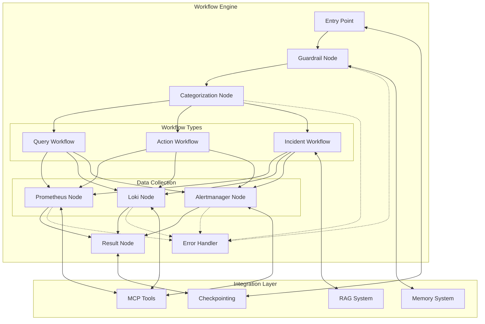
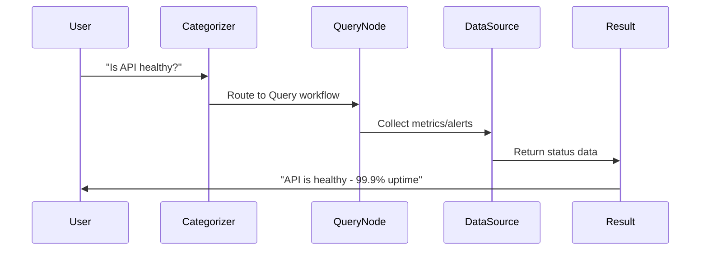
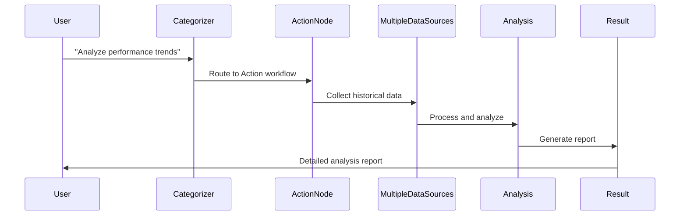
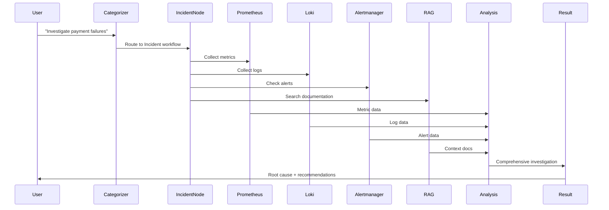
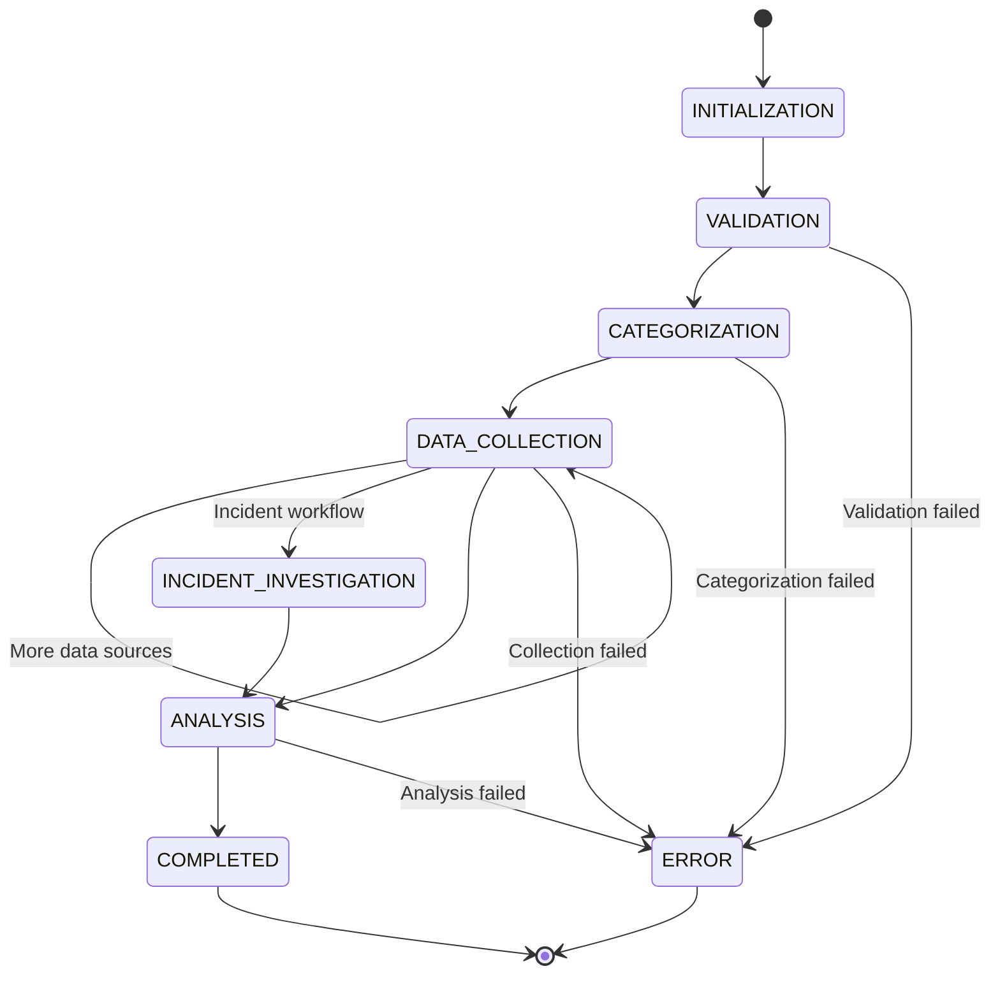

# ⚡ Workflows Documentation

Comprehensive guide to Paladin AI's LangGraph-based workflow system for intelligent monitoring and incident response.

## Overview

The Paladin AI workflow system is built on **LangGraph**, a state-based workflow orchestration framework that provides sophisticated workflow management for SRE (Site Reliability Engineering) and DevOps operations. The system implements intelligent routing, automatic data collection, memory integration, and real-time execution capabilities.

## Architecture Overview



## Workflow Types

### 1. Query Workflows

**Purpose**: Quick status and information requests  
**Response Time**: < 30 seconds  
**Complexity**: Low to Medium

#### Characteristics
- Simple boolean or metric queries
- Single data source typically sufficient
- Fast response expectations
- Minimal data processing required

#### Examples
```bash
# System status checks
"Is the payment service healthy?"
"What's the current CPU usage?"
"Are there any critical alerts?"

# Metric queries
"Show me response times for the API"
"How many requests per second are we handling?"
"What's the memory usage of the database?"
```

#### Data Flow


### 2. Action Workflows

**Purpose**: Data analysis, reporting, and configuration tasks  
**Response Time**: 1-5 minutes  
**Complexity**: Medium to High

#### Characteristics
- Data retrieval and analysis
- Historical trend analysis
- Performance reporting
- Capacity planning

#### Examples
```bash
# Performance analysis
"Analyze API performance over the last week"
"Compare current metrics to baseline"
"Generate a capacity planning report"

# Data analysis
"Find patterns in error logs"
"Analyze user behavior trends"
"Review resource utilization"
```

#### Data Flow


### 3. Incident Workflows

**Purpose**: Problem investigation and root cause analysis  
**Response Time**: 2-10 minutes  
**Complexity**: High

#### Characteristics
- Multi-source data collection
- Comprehensive investigation
- Root cause analysis
- Resolution recommendations

#### Examples
```bash
# Incident investigation
"Users are reporting slow response times"
"Investigate payment service failures"
"Why is the database connection pool exhausted?"

# Root cause analysis
"Analyze the cause of the recent outage"
"What led to the memory leak?"
"Investigate unusual error patterns"
```

#### Data Flow


## Core Workflow Nodes

### 1. Start Node

**File**: `server/graph/nodes/start.py`

**Purpose**: Initialize workflow execution

```python
async def start_node(state: WorkflowState) -> WorkflowState:
    """Initialize workflow state and prepare for execution"""
    
    # Generate session ID if not provided
    if not state.session_id:
        state.session_id = f"session_{int(time.time())}_{uuid.uuid4().hex[:8]}"
    
    # Initialize metadata
    state.metadata = {
        "start_time": time.time(),
        "execution_id": str(uuid.uuid4()),
        "workflow_version": "1.0.0"
    }
    
    # Set initial execution phase
    state.current_phase = ExecutionPhase.INITIALIZATION
    state.execution_path = ["start"]
    
    return state
```

### 2. Guardrail Node

**File**: `server/graph/nodes/guardrail.py`

**Purpose**: Validate input relevance and enhance with memory

```python
async def guardrail_node(state: WorkflowState) -> WorkflowState:
    """Validate input and enhance with memory instructions"""
    
    user_input = state.user_input
    
    # Check relevance to SRE/DevOps scope
    relevance_check = await check_sre_relevance(user_input)
    
    if not relevance_check["is_relevant"]:
        state.final_result = {
            "type": "static_response",
            "content": relevance_check["static_response"],
            "reasoning": "Input not related to SRE/DevOps operations"
        }
        return state
    
    # Enhance input with memory instructions
    memory_instructions = await get_memory_instructions(user_input)
    if memory_instructions:
        state.enhanced_input = f"{user_input}\n\nRelevant instructions:\n" + \
                             "\n".join(f"- {inst}" for inst in memory_instructions)
        state.memory_instructions = memory_instructions
    else:
        state.enhanced_input = user_input
    
    state.current_phase = ExecutionPhase.VALIDATION
    return state
```

### 3. Categorization Node

**File**: `server/graph/nodes/categorization.py`

**Purpose**: Classify requests and determine workflow routing

```python
async def categorize_node(state: WorkflowState) -> WorkflowState:
    """Categorize user input and determine workflow type"""
    
    input_text = state.enhanced_input or state.user_input
    
    # Use AI to categorize the request
    categorization_result = await categorize_request(input_text)
    
    state.categorization = CategorizationResult(
        workflow_type=categorization_result["workflow_type"],
        confidence=categorization_result["confidence"],
        reasoning=categorization_result["reasoning"],
        complexity=categorization_result["complexity"],
        estimated_duration_seconds=categorization_result["estimated_duration"],
        requires_metrics=categorization_result["data_requirements"]["metrics"],
        requires_logs=categorization_result["data_requirements"]["logs"],
        requires_alerts=categorization_result["data_requirements"]["alerts"]
    )
    
    state.current_phase = ExecutionPhase.CATEGORIZATION
    return state
```

### 4. Workflow-Specific Nodes

#### Query Node
```python
async def query_node(state: WorkflowState) -> WorkflowState:
    """Handle quick information requests"""
    
    categorization = state.categorization
    
    # Determine data collection requirements
    if categorization.requires_metrics:
        state.next_node = "prometheus"
    elif categorization.requires_alerts:
        state.next_node = "alertmanager"
    else:
        # Direct response for simple queries
        state.next_node = "result"
    
    state.current_phase = ExecutionPhase.DATA_COLLECTION
    return state
```

#### Action Node
```python
async def action_node(state: WorkflowState) -> WorkflowState:
    """Handle data analysis and reporting requests"""
    
    categorization = state.categorization
    
    # Plan data collection sequence
    data_sources = []
    if categorization.requires_metrics:
        data_sources.append("prometheus")
    if categorization.requires_logs:
        data_sources.append("loki")
    if categorization.requires_alerts:
        data_sources.append("alertmanager")
    
    # Set first data source
    state.next_node = data_sources[0] if data_sources else "result"
    state.remaining_data_sources = data_sources[1:]
    
    state.current_phase = ExecutionPhase.DATA_COLLECTION
    return state
```

#### Incident Node
```python
async def incident_node(state: WorkflowState) -> WorkflowState:
    """Handle incident investigation workflows"""
    
    # Incident workflows typically require comprehensive data
    state.investigation_focus = extract_investigation_focus(state.user_input)
    
    # Always start with metrics for incidents
    state.next_node = "prometheus"
    state.remaining_data_sources = ["loki", "alertmanager"]
    
    # Add RAG search for documentation
    state.requires_rag_search = True
    
    state.current_phase = ExecutionPhase.INCIDENT_INVESTIGATION
    return state
```

### 5. Data Collection Nodes

#### Prometheus Node
**File**: `server/graph/nodes/prometheus/node.py`

```python
async def prometheus_node(state: WorkflowState) -> WorkflowState:
    """Collect and analyze Prometheus metrics"""
    
    try:
        # Generate metrics collection plan
        collection_plan = await generate_metrics_plan(
            user_input=state.enhanced_input or state.user_input,
            workflow_type=state.categorization.workflow_type
        )
        
        # Execute metrics collection
        metrics_data = await collect_prometheus_data(collection_plan)
        
        # Store results
        state.node_results["prometheus"] = NodeResult(
            node_name="prometheus",
            status="success",
            data=metrics_data,
            metadata={"queries_executed": len(collection_plan["queries"])}
        )
        
        # Determine next node
        if state.remaining_data_sources:
            state.next_node = state.remaining_data_sources.pop(0)
        else:
            state.next_node = "result"
            
    except Exception as e:
        state.node_results["prometheus"] = NodeResult(
            node_name="prometheus",
            status="error",
            error=str(e)
        )
        state.next_node = "error_handler"
    
    return state
```

### 6. Result Node

**File**: `server/graph/nodes/result.py`

```python
async def result_node(state: WorkflowState) -> WorkflowState:
    """Generate final response from collected data"""
    
    # Collect all successful node results
    collected_data = {}
    for node_name, result in state.node_results.items():
        if result.status == "success" and result.data:
            collected_data[node_name] = result.data
    
    # Generate AI-powered analysis
    final_response = await generate_final_response(
        user_input=state.user_input,
        enhanced_input=state.enhanced_input,
        workflow_type=state.categorization.workflow_type,
        collected_data=collected_data,
        memory_instructions=state.memory_instructions
    )
    
    # Calculate execution metrics
    execution_time = int((time.time() - state.metadata["start_time"]) * 1000)
    
    state.final_result = {
        "content": final_response,
        "workflow_type": state.categorization.workflow_type.value,
        "execution_time_ms": execution_time,
        "data_sources_used": list(collected_data.keys()),
        "session_id": state.session_id
    }
    
    state.current_phase = ExecutionPhase.COMPLETED
    return state
```

## State Management

### WorkflowState Model

```python
class WorkflowState(BaseModel):
    # Input and enhancement
    user_input: str
    enhanced_input: Optional[str] = None
    memory_instructions: List[str] = []
    session_id: Optional[str] = None
    
    # Categorization
    categorization: Optional[CategorizationResult] = None
    
    # Execution control
    current_node: str = "start"
    current_phase: ExecutionPhase = ExecutionPhase.INITIALIZATION
    execution_path: List[str] = []
    next_node: Optional[str] = None
    remaining_data_sources: List[str] = []
    
    # Results and data
    final_result: Optional[Dict[str, Any]] = None
    node_results: Dict[str, NodeResult] = {}
    
    # Performance tracking
    total_api_calls: int = 0
    total_tokens_used: int = 0
    execution_time_ms: Optional[int] = None
    
    # Context and metadata
    metadata: Dict[str, Any] = {}
    user_context: Dict[str, Any] = {}
    requires_rag_search: bool = False
    investigation_focus: Optional[str] = None
```

### State Transitions



## Conditional Routing

### Routing Logic

```python
class PaladinWorkflow:
    def _route_from_categorization(self, state: WorkflowState) -> str:
        """Route based on categorization results"""
        
        if state.final_result:
            return "result"
        
        if not state.categorization:
            return "error_handler"
        
        workflow_type = state.categorization.workflow_type
        
        if workflow_type == WorkflowType.QUERY:
            return "query"
        elif workflow_type == WorkflowType.ACTION:
            return "action"
        elif workflow_type == WorkflowType.INCIDENT:
            return "incident"
        else:
            return "error_handler"
    
    def _route_from_data_collection(self, state: WorkflowState) -> str:
        """Route after data collection"""
        
        if state.next_node == "error_handler":
            return "error_handler"
        elif state.next_node == "result":
            return "result"
        elif state.next_node in ["prometheus", "loki", "alertmanager"]:
            return state.next_node
        else:
            return "result"
```

### Decision Factors

1. **Categorization Results**: Workflow type and confidence
2. **Data Requirements**: Metrics, logs, alerts needed
3. **Error Conditions**: Node execution failures
4. **Completion Status**: All required data collected
5. **Next Node Specification**: Explicit routing decisions

## Memory Integration

### Memory Enhancement Process

```python
async def get_memory_instructions(user_input: str) -> List[str]:
    """Retrieve relevant memory instructions for input enhancement"""
    
    memory_service = get_memory_service()
    
    # Search for relevant memories
    search_result = await memory_service.search_memories(
        MemorySearchQuery(
            query=user_input,
            memory_types=["instruction", "operational"],
            limit=5,
            confidence_threshold=0.7
        )
    )
    
    # Extract instruction content
    instructions = []
    if search_result["success"]:
        for memory in search_result["memories"]:
            if memory["memory_type"] == "instruction":
                instructions.append(memory["content"])
    
    return instructions
```

### Memory Extraction

```python
async def extract_workflow_memories(state: WorkflowState) -> Dict[str, Any]:
    """Extract valuable memories from completed workflow"""
    
    if not should_extract_memories(state):
        return {"success": True, "memories_stored": 0}
    
    # Format workflow content for extraction
    workflow_content = format_workflow_for_memory_extraction(state)
    
    # Extract memories
    extraction_request = MemoryExtractionRequest(
        content=workflow_content,
        user_input=state.user_input,
        workflow_type=state.categorization.workflow_type.value,
        session_id=state.session_id,
        context={
            "execution_time_ms": state.execution_time_ms,
            "data_sources_used": list(state.node_results.keys()),
            "success": state.current_phase == ExecutionPhase.COMPLETED
        }
    )
    
    memory_service = get_memory_service()
    result = await memory_service.extract_and_store_memories(extraction_request)
    
    return result
```

## RAG Integration

### Document Search in Workflows

```python
async def rag_search_node(state: WorkflowState) -> WorkflowState:
    """Search relevant documentation using RAG system"""
    
    if not state.requires_rag_search:
        state.next_node = determine_next_data_source(state)
        return state
    
    try:
        # Generate search queries based on context
        search_queries = await generate_rag_search_queries(
            user_input=state.user_input,
            investigation_focus=state.investigation_focus,
            workflow_type=state.categorization.workflow_type
        )
        
        # Execute searches
        rag_results = []
        for query in search_queries:
            search_result = await rag_service.search_documents(
                query=query["query"],
                limit=query.get("limit", 3),
                score_threshold=query.get("threshold", 0.7)
            )
            
            if search_result["results"]:
                rag_results.extend(search_result["results"])
        
        # Store RAG results
        state.node_results["rag_search"] = NodeResult(
            node_name="rag_search",
            status="success",
            data={"documents": rag_results},
            metadata={"queries_executed": len(search_queries)}
        )
        
    except Exception as e:
        state.node_results["rag_search"] = NodeResult(
            node_name="rag_search",
            status="error",
            error=str(e)
        )
    
    # Continue to next data source
    state.next_node = determine_next_data_source(state)
    return state
```

## Error Handling and Recovery

### Error Categories

```python
class ErrorCategory(str, Enum):
    API_ERROR = "api_error"
    INPUT_ERROR = "input_error"
    PARSING_ERROR = "parsing_error"
    NETWORK_ERROR = "network_error"
    SYSTEM_ERROR = "system_error"
    TIMEOUT_ERROR = "timeout_error"
```

### Error Handler Node

```python
async def error_handler_node(state: WorkflowState) -> WorkflowState:
    """Handle workflow errors and provide recovery options"""
    
    # Determine error category and context
    error_info = analyze_workflow_errors(state)
    
    # Generate user-friendly error message
    error_response = await generate_error_response(
        error_category=error_info["category"],
        error_details=error_info["details"],
        partial_results=error_info["partial_results"],
        user_input=state.user_input
    )
    
    state.final_result = {
        "type": "error_response",
        "content": error_response["message"],
        "error_category": error_info["category"],
        "recovery_suggestions": error_response["suggestions"],
        "partial_results": error_info["partial_results"]
    }
    
    state.current_phase = ExecutionPhase.ERROR
    return state
```

### Recovery Strategies

1. **Automatic Retry**: Transient errors with exponential backoff
2. **Partial Results**: Preserve successful node results
3. **Graceful Degradation**: Alternative data sources
4. **User Guidance**: Context-specific error messages
5. **Fallback Workflows**: Simplified execution paths

## Checkpointing and Persistence

### MongoDB Checkpointing

```python
class MongoCheckpointer:
    async def save_checkpoint(
        self, 
        session_id: str, 
        state: WorkflowState
    ) -> Dict[str, Any]:
        """Save workflow state as checkpoint"""
        
        checkpoint_data = {
            "session_id": session_id,
            "state": state.dict(),
            "created_at": datetime.utcnow(),
            "workflow_type": state.categorization.workflow_type.value if state.categorization else None,
            "current_node": state.current_node,
            "execution_phase": state.current_phase.value
        }
        
        # Upsert checkpoint
        await self.collection.replace_one(
            {"session_id": session_id},
            checkpoint_data,
            upsert=True
        )
        
        return {"success": True, "checkpoint_id": str(checkpoint_data["_id"])}
    
    async def load_checkpoint(self, session_id: str) -> Optional[WorkflowState]:
        """Load workflow state from checkpoint"""
        
        checkpoint = await self.collection.find_one({"session_id": session_id})
        
        if checkpoint:
            return WorkflowState(**checkpoint["state"])
        
        return None
```

### Checkpoint Integration

```python
# Automatic checkpointing after each node
async def execute_with_checkpointing(
    self, 
    user_input: str, 
    session_id: Optional[str] = None
) -> Dict[str, Any]:
    """Execute workflow with automatic checkpointing"""
    
    # Load existing checkpoint if available
    if session_id:
        saved_state = await self.checkpointer.load_checkpoint(session_id)
        if saved_state:
            initial_state = saved_state
        else:
            initial_state = create_initial_state(user_input, session_id)
    else:
        session_id = generate_session_id()
        initial_state = create_initial_state(user_input, session_id)
    
    # Execute workflow with checkpointing
    async for state in self.graph.astream(initial_state):
        # Save checkpoint after each node
        await self.checkpointer.save_checkpoint(session_id, state)
        
        # Yield state for streaming
        yield state
```

## Streaming and Real-time Execution

### Streaming Implementation

```python
async def stream_workflow(
    self, 
    user_input: str, 
    session_id: Optional[str] = None
) -> AsyncGenerator[Dict[str, Any], None]:
    """Stream workflow execution in real-time"""
    
    initial_state = create_initial_state(user_input, session_id)
    
    async for state in self.graph.astream(initial_state):
        # Format streaming update
        update = {
            "current_node": state.current_node,
            "current_phase": state.current_phase.value,
            "execution_path": state.execution_path,
            "progress": calculate_progress(state),
            "partial_results": extract_partial_results(state),
            "status": "in_progress" if state.current_phase != ExecutionPhase.COMPLETED else "completed"
        }
        
        # Include final result when completed
        if state.final_result:
            update["final_result"] = state.final_result
        
        yield update
```

### Real-time Features

1. **Progressive Updates**: Node-by-node execution progress
2. **Live Status**: Current processing phase and node
3. **Partial Results**: Intermediate data as it becomes available
4. **Error Streaming**: Real-time error notifications
5. **Performance Metrics**: Live execution statistics

## Configuration and Customization

### Workflow Configuration

```python
class GraphConfig(BaseModel):
    # Execution settings
    max_execution_time_seconds: int = 600  # 10 minutes
    enable_streaming: bool = True
    enable_checkpointing: bool = True
    
    # Performance settings
    max_concurrent_tools: int = 3
    node_timeout_seconds: int = 120
    retry_attempts: int = 3
    
    # Integration settings
    enable_langfuse_tracing: bool = True
    enable_memory_enhancement: bool = True
    enable_rag_search: bool = True
    
    # AI settings
    openai_model: str = "gpt-4o-mini"
    openai_temperature: float = 0.1
    max_tokens: int = 4000
```

### Environment Configuration

```bash
# Workflow Configuration
WORKFLOW_MAX_EXECUTION_TIME=600
WORKFLOW_NODE_TIMEOUT=120
WORKFLOW_RETRY_ATTEMPTS=3

# LangGraph Settings
LANGGRAPH_ENABLE_CHECKPOINTING=true
LANGGRAPH_ENABLE_STREAMING=true

# Memory Integration
MEMORY_ENHANCEMENT_ENABLED=true
MEMORY_INSTRUCTION_LIMIT=5

# RAG Integration
RAG_SEARCH_ENABLED=true
RAG_SEARCH_LIMIT=3
RAG_SCORE_THRESHOLD=0.7

# Observability
LANGFUSE_TRACING_ENABLED=true
LANGFUSE_PROJECT_NAME=paladin-ai
```

## Usage Examples

### 1. Basic Query Workflow

```python
# CLI usage
paladin --chat "Is the payment service healthy?"

# Expected flow:
# start → guardrail → categorize → query → prometheus → result
```

### 2. Complex Incident Workflow

```python
# CLI usage
paladin --chat "Users are reporting payment failures, investigate the issue"

# Expected flow:
# start → guardrail → categorize → incident → prometheus → loki → alertmanager → rag_search → result
```

### 3. Streaming Execution

```python
# API usage
async for update in workflow.stream("Analyze API performance trends"):
    print(f"Current phase: {update['current_phase']}")
    print(f"Progress: {update['progress']}%")
    
    if update['status'] == 'completed':
        print(f"Final result: {update['final_result']['content']}")
```

### 4. Session Resumption

```python
# Resume previous session
session_id = "session_1234567890_abc123"
result = await workflow.execute(
    "Continue analyzing the database performance issue",
    session_id=session_id
)
```

## Performance Optimization

### 1. Concurrent Execution

```python
# Parallel data collection (when safe)
async def collect_multiple_sources(state: WorkflowState):
    """Collect data from multiple sources concurrently"""
    
    tasks = []
    
    if state.categorization.requires_metrics:
        tasks.append(collect_prometheus_data(state))
    
    if state.categorization.requires_alerts:
        tasks.append(collect_alertmanager_data(state))
    
    # Execute concurrently
    results = await asyncio.gather(*tasks, return_exceptions=True)
    
    # Process results
    for i, result in enumerate(results):
        if not isinstance(result, Exception):
            source_name = ["prometheus", "alertmanager"][i]
            state.node_results[source_name] = NodeResult(
                node_name=source_name,
                status="success",
                data=result
            )
```

### 2. Caching Strategies

```python
@lru_cache(maxsize=100)
async def cached_categorization(input_hash: str) -> CategorizationResult:
    """Cache categorization results for similar inputs"""
    # Implementation with caching
    pass

# State optimization
def optimize_state_for_storage(state: WorkflowState) -> WorkflowState:
    """Optimize state for checkpoint storage"""
    
    # Remove large data objects that can be regenerated
    optimized_state = state.copy()
    
    # Keep only essential node results
    for node_name, result in optimized_state.node_results.items():
        if result.data and len(str(result.data)) > 10000:
            result.data = {"summary": "Large data cached separately"}
    
    return optimized_state
```

### 3. Resource Management

```python
class ResourceManager:
    def __init__(self):
        self.active_workflows = {}
        self.max_concurrent_workflows = 10
    
    async def execute_with_limits(
        self, 
        workflow_id: str, 
        execution_func
    ):
        """Execute workflow with resource limits"""
        
        if len(self.active_workflows) >= self.max_concurrent_workflows:
            raise ResourceLimitExceeded("Too many concurrent workflows")
        
        self.active_workflows[workflow_id] = time.time()
        
        try:
            result = await execution_func()
            return result
        finally:
            del self.active_workflows[workflow_id]
```

## Monitoring and Observability

### 1. Langfuse Integration

```python
from langfuse import Langfuse

class WorkflowObservability:
    def __init__(self):
        self.langfuse = Langfuse()
    
    async def trace_workflow_execution(
        self, 
        session_id: str, 
        user_input: str
    ):
        """Create tracing session for workflow"""
        
        trace = self.langfuse.trace(
            name="paladin_workflow",
            session_id=session_id,
            input=user_input,
            metadata={
                "workflow_version": "1.0.0",
                "execution_mode": "streaming"
            }
        )
        
        return trace
    
    async def trace_node_execution(
        self, 
        trace, 
        node_name: str, 
        state: WorkflowState
    ):
        """Trace individual node execution"""
        
        span = trace.span(
            name=f"node_{node_name}",
            input=state.dict(),
            metadata={
                "node_type": node_name,
                "execution_phase": state.current_phase.value
            }
        )
        
        return span
```

### 2. Performance Metrics

```python
class WorkflowMetrics:
    def __init__(self):
        self.execution_times = {}
        self.node_performance = {}
        self.error_rates = {}
    
    def record_workflow_execution(
        self, 
        workflow_type: str, 
        execution_time_ms: int,
        success: bool
    ):
        """Record workflow performance metrics"""
        
        if workflow_type not in self.execution_times:
            self.execution_times[workflow_type] = []
        
        self.execution_times[workflow_type].append(execution_time_ms)
        
        # Calculate error rate
        if workflow_type not in self.error_rates:
            self.error_rates[workflow_type] = {"total": 0, "errors": 0}
        
        self.error_rates[workflow_type]["total"] += 1
        if not success:
            self.error_rates[workflow_type]["errors"] += 1
    
    def get_performance_summary(self) -> Dict[str, Any]:
        """Get performance summary across all workflows"""
        
        summary = {}
        
        for workflow_type, times in self.execution_times.items():
            error_data = self.error_rates.get(workflow_type, {"total": 0, "errors": 0})
            
            summary[workflow_type] = {
                "avg_execution_time_ms": sum(times) / len(times),
                "min_execution_time_ms": min(times),
                "max_execution_time_ms": max(times),
                "total_executions": len(times),
                "error_rate": error_data["errors"] / error_data["total"] if error_data["total"] > 0 else 0
            }
        
        return summary
```

## Troubleshooting

### Common Issues

#### 1. Workflow Timeout

```bash
# Check execution time limits
export WORKFLOW_MAX_EXECUTION_TIME=900  # 15 minutes

# Monitor long-running workflows
paladin --chat "Simple status check"  # Test with simple query first
```

#### 2. Node Execution Failures

```bash
# Check individual tool connectivity
curl http://localhost:9090/-/healthy  # Prometheus
curl http://localhost:3100/ready      # Loki
curl http://localhost:9093/-/healthy  # Alertmanager

# Test workflow with debug logging
export LOG_LEVEL=debug
paladin --debug --chat "Test workflow execution"
```

#### 3. Memory Enhancement Issues

```bash
# Check memory service health
paladin --memory-health

# Test memory search
paladin --memory-search "test query" --limit 1
```

#### 4. Checkpoint Recovery

```bash
# List available checkpoints
paladin --checkpoint-list --session session_123

# Test checkpoint restoration
paladin --checkpoint-get session_123
```

### Debug Commands

```bash
# Test workflow categorization
paladin --chat "Debug: categorize this request"

# Monitor workflow execution
tail -f logs/workflow.log | grep -E "(node_execution|error|completion)"

# Check workflow performance
curl http://localhost:8000/api/v1/workflow/metrics
```

## Best Practices

### 1. Workflow Design

- **Clear Intent**: Use specific, actionable language
- **Scope Definition**: Clearly define workflow boundaries
- **Error Handling**: Plan for failure scenarios
- **Performance**: Consider execution time limits

### 2. Memory Integration

- **Instruction Storage**: Store specific, actionable instructions
- **Context Relevance**: Ensure memory context matches use cases
- **Regular Cleanup**: Remove outdated instructions
- **Validation**: Verify memory enhancement effectiveness

### 3. Monitoring

- **Performance Tracking**: Monitor execution times and success rates
- **Error Analysis**: Analyze failure patterns and root causes
- **Resource Usage**: Track memory and CPU utilization
- **User Experience**: Monitor response quality and relevance

### 4. Optimization

- **Efficient Routing**: Minimize unnecessary node executions
- **Data Collection**: Collect only required data sources
- **Caching**: Implement appropriate caching strategies
- **Resource Limits**: Set reasonable execution boundaries

---

The Paladin AI workflow system provides a robust, intelligent foundation for SRE automation, combining the power of LangGraph's state management with AI-driven decision making, comprehensive tool integration, and real-time execution capabilities.